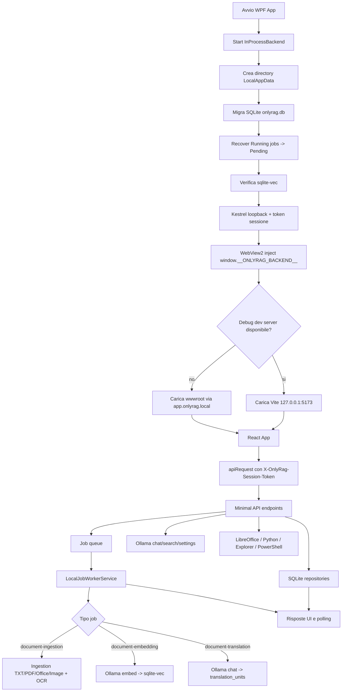

# APP_FLOW.md

Audit del flusso reale ricostruito dal codice, non dal README.

## Schema alto livello

OnlyRag e una app desktop Windows WPF che avvia un backend ASP.NET Core Minimal API in-process su loopback. La UI React/Vite viene caricata dentro WebView2: in Debug puo usare Vite su `127.0.0.1:5173`, altrimenti usa asset statici mappati su `https://app.onlyrag.local`. Il backend protegge quasi tutte le API `/api/*` con token di sessione generato all'avvio e iniettato nella pagina WebView.

Persistenza locale:
- database documenti, settings, chat, OCR cache e traduzioni: SQLite `onlyrag.db`;
- coda job: SQLite `jobs.db`;
- file originali/render/export/log/temp sotto `%LOCALAPPDATA%\OnlyRag`;
- vettori embedding in SQLite con `sqlite-vec`.

Integrazioni:
- Ollama via HTTP per modelli, chat, embedding e traduzione;
- LibreOffice `soffice.exe` per conversione Office legacy/PDF export;
- Python PaddleOCR bridge per OCR;
- Windows Explorer/PowerShell per aperture cartelle e provisioning.

## Mermaid

## Flusso utente principale

1. L'app WPF parte e prova ad avviare il backend.
2. Se backend parte, `App.xaml.cs` passa `baseUrl` e token alla finestra principale.
3. `MainWindow.xaml.cs` verifica Windows/WebView2, inizializza WebView2, inietta il bridge JS e carica UI.
4. React mostra sidebar: Chat, Documenti, Operazioni, Traduzione, Impostazioni.
5. All'avvio React chiama `/api/app/status`, `/api/settings/ollama`, `/api/ollama/status`, `/api/dependencies/ollama`.
6. L'utente importa documenti dalla sezione Documenti.
7. Backend salva file originale, crea record documento, crea job `document-ingestion`.
8. Worker legge job Pending, lo porta Running, esegue ingestion e aggiorna progress/checkpoint.
9. Se configurato un modello embedding, ingestion accoda `document-embedding`.
10. Chat con documenti selezionati chiama retrieval ibrido keyword/vector, costruisce prompt RAG e chiama Ollama.
11. Traduzione crea `translations` e `translation_units`, poi accoda `document-translation`.
12. UI aggiorna documenti/job/status tramite polling.
13. In chiusura WPF chiede stato alla UI, chiama `/api/app/prepare-shutdown`, cancella job attivi e dispone backend.

## Flusso dati

Import:
1. `DocumentsSection` manda multipart `/api/documents/import`.
2. `InProcessBackend.DocumentEndpoints` valida content type, dimensioni e batch.
3. `LocalDocumentLibraryService.ImportAsync` normalizza nome/estensione, copia stream in file temporaneo, calcola SHA-256, controlla deduplica, sposta in `documents/originals`.
4. `SqliteDocumentRepository` crea `documents`.
5. `SqliteLocalJobQueue` crea `jobs`.
6. Worker esegue `DocumentIngestionJobHandler`.
7. `DocumentIngestionService` estrae testo o chiama OCR/conversione, salva `document_pages` e `chunks`.
8. Se embedding model presente, `DocumentEmbeddingJobHandler` chiama Ollama `/api/embed` e salva `embeddings`.

Chat:
1. UI invia `ChatRequest` con messaggio, modello, flag `useDocuments`, document IDs e conversationId.
2. `ChatService` valida messaggio/modello/conversationId.
3. Se documentale, chiama `HybridRetrievalService`.
4. Retrieval fa keyword FTS e, se possibile, embedding query + vector search.
5. Risultati vengono fusi e passati nel prompt.
6. Ollama produce risposta.
7. Turno user/assistant viene salvato in `chat_messages`; UI salva anche sessione/draft in storage WebView.

Traduzione:
1. UI crea traduzione su `/api/translations`.
2. Backend verifica documento indicizzato, modello e target language.
3. Repository costruisce unita sorgente da pagine/chunks e crea `translations`/`translation_units`.
4. Worker traduce unita pending/failed una alla volta, valida placeholder, salva success/failure e checkpoint.
5. Export scrive TXT/MD/HTML/DOCX/PDF in `documents/exports`.

## Flusso auth/autorizzazione

- Backend accetta solo bind loopback.
- Token sessione random 32 byte hex generato a ogni avvio, salvo override opzioni.
- Token passato al frontend via `window.__ONLYRAG_BACKEND__`.
- `apiRequest` aggiunge header `X-OnlyRag-Session-Token`.
- Middleware rifiuta tutte le rotte `/api/*` senza token.
- `/health` resta una liveness route minimale non autenticata e non espone metadati runtime.
- Non ci sono utenti, ruoli o ACL: e un modello single-user local-first.

Punti fragili:
- Un XSS nella UI o una pagina dev server con bridge iniettato avrebbe token completo.
- Le azioni di provisioning possono avviare processi locali se il token e disponibile.

## Flusso persistenza/database

- `LocalSqliteMigrator` crea/migra schema.
- `LocalSqliteConnectionFactory` abilita WAL, foreign_keys e busy_timeout.
- `documents` punta a file fisico `original_path`.
- `document_pages`, `chunks`, `embeddings`, `translations`, `translation_units`, `chat_messages`, `settings`, `ocr_cache` vivono nello stesso DB.
- `jobs` vive in coda SQLite dedicata.
- La coda usa stati stringa: Pending, Running, Completed, Failed, Cancelled, Paused.

Punti fragili:
- `sha256` documento non e unique.
- Stati DB sono TEXT senza CHECK.
- Coerenza DB/filesystem dipende dal codice applicativo.
- Job pause/resume ha race tra DB status e token cancellation.

## Flusso errori/fallback

- Backend ha `UseExceptionHandler` per errori non gestiti, logga localmente e ritorna ProblemDetails generico con correlationId.
- Errori Ollama vengono mappati a 400/404/408/502/503.
- Errori import noti tornano 400/413.
- Retrieval vettoriale non disponibile viene degradato a keyword dove possibile.
- PDF senza testo prova OCR; Office OpenXML fallito prova conversione via LibreOffice/PDF.
- UI spesso mostra banner o feedback, ma diversi polling ignorano errori e lasciano stato stale.

## Stati principali

Documenti:
- Imported
- Queued
- Processing
- Indexed
- RequiresAdditionalComponent
- Failed

Job:
- Pending
- Running
- Completed
- Failed
- Cancelled
- Paused

Pipeline UI:
- Todo
- InProgress
- Completed
- Skipped
- Failed
- Obsolete

Traduzioni:
- Queued
- Running
- Completed
- Failed
- Corrected a livello unita

Ollama:
- Online
- Offline
- errore URL/model/timeout/unreachable

## Assunzioni implicite

- Una sola istanza utente controlla lo stesso `%LOCALAPPDATA%\OnlyRag`.
- Il filesystem e SQLite restano coerenti.
- I processi OCR/LibreOffice/Python rispettano cancellazione/timeout.
- L'utente si fida dei documenti importati nel prompt RAG.
- La UI e l'unico client API rilevante.
- Il token JS e sufficiente come boundary locale.
- I modelli Ollama installati hanno comportamento compatibile con chat, embed e traduzione.
- Build web viene eseguita prima di build/distribuzione app.
- Le verifiche manuali installer/UI completano cio che il gate automatico non copre.

## Punti fragili del flusso

- Pausa/ripresa job non e atomicamente coordinata con il worker.
- Deduplica documento non e protetta da vincolo DB.
- OCR bridge puo bloccarsi su I/O processo.
- Provisioning OCR/Ollama avvia processi esterni con controllo limitato.
- La UI puo diventare stale per catch silenziosi nei polling.
- Non esiste contratto API generato.
- I test frontend unit/component e smoke E2E esistono, ma la verifica popolata WPF/WebView/Ollama/OCR con dati reali resta fuori dal gate automatico.
- Il gate automatico verifica packaging solo con `-IncludeInstaller`; signing, lifecycle installer e wizard interattivo restano gate release separati.
