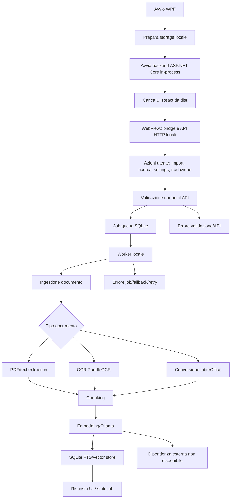

# Audit Tracker

> Documento temporaneo. Rimuovere questo file solo quando tutti i finding sono `DONE`, le correzioni sono state verificate e non restano domande aperte bloccanti.

## 1. Executive summary

- Stato progetto: Rischioso
- Motivazione sintetica: build .NET e frontend passano, ma il gate test .NET fallisce e il codice di ingestione PDF/OCR contiene un bug verificabile di checkpoint che puo' corrompere chunk gia' salvati in caso di resume durante OCR. Sono presenti anche rischi di sicurezza/robustezza su esecuzione LibreOffice configurabile, contratti API per modelli Ollama e copertura E2E insufficiente.
- Numero finding per gravita':
  - Critical: 1
  - High: 3
  - Medium: 5
  - Low: 1
- Rischi principali:
  - Corruzione dati e indice ricerca durante resume OCR.
  - Gate di test .NET non affidabile su percorso job/SQLite.
  - Export traduzioni che puo' dichiarare completato un file contenente testo sorgente non tradotto.
  - Esecuzione di un binario configurabile come LibreOffice senza vincoli forti.
  - Packaging/build app non atomico rispetto agli asset web richiesti a runtime.
- Priorita' immediate:
  1. Correggere checkpoint OCR e aggiungere test di resume con pagine precedenti gia' salvate.
  2. Riparare il test .NET fallente o il lifetime SQLite che lo rende non deterministico.
  3. Bloccare/exportare esplicitamente traduzioni incomplete.
  4. Restringere/validare il path LibreOffice configurato.
  5. Rendere il build app dipendente dalla build web o fallire con errore chiaro.

## 2. Contesto audit

- Data audit: 2026-05-23
- Branch: `main`
- Stato git iniziale: ` M AGENTS.md`
- Presenza iniziale di `AUDIT_TRACKER.md`: assente
- Tipo progetto rilevato: applicazione desktop Windows local-first con UI web embedded, backend/API in-process, pipeline RAG/OCR/traduzione e packaging installer.
- Stack rilevato:
  - Linguaggi: C#, TypeScript, PowerShell.
  - Runtime/framework: .NET 10, WPF, ASP.NET Core Minimal API, React, Vite.
  - Package manager: npm per frontend; NuGet/.NET SDK per backend/app.
  - Persistenza: SQLite locale con `Microsoft.Data.Sqlite`, FTS e `sqlite-vec`.
  - Integrazioni esterne: Ollama, PaddleOCR via Python bridge, LibreOffice, WebView2.
  - Test/check: xUnit, Vitest, Playwright, lint/typecheck/format frontend, script PowerShell `Invoke-Gate.ps1`.
  - CI/CD: workflow GitHub Actions Windows rilevati in `.github/workflows`.
  - Containerizzazione: non rilevata come flusso primario.
- Limiti dell'audit:
  - Nessuna modifica a codice, configurazioni, lockfile, test o documentazione esistente.
  - Dependency audit non eseguito per evitare restore/install/rete e possibili modifiche di lock/cache.
  - Non eseguiti installer package, firma, deploy o publish.
  - Non verificata esecuzione reale WPF/WebView2 interattiva.
- Aree non verificabili:
  - Comportamento reale con Ollama/PaddleOCR/LibreOffice installati e lenti/non disponibili.
  - Installer firmato e distribuzione.
  - Sicurezza runtime in ambiente multiutente reale.
  - Performance su corpus documentali grandi.

## 3. Comandi eseguiti

| Comando | Esito | Output sintetico | Note |
|---|---:|---|---|
| `git status --short` | ok | ` M AGENTS.md` | Stato iniziale prima di creare questo file; modifica preesistente non toccata. |
| `git branch --show-current` | ok | `main` | Branch corrente. |
| `Test-Path AUDIT_TRACKER.md` | ok | `False` | Tracker assente all'inizio. |
| `rg --files` / `git ls-files` / letture mirate | ok | 457 file tracciati; repo con `src`, `tests`, `scripts`, `docs`, `packaging`, `assets`, `certificates`. | Usati per ricostruire stack e struttura. |
| `dotnet --info` | ok | SDK 10.0.300; runtime 10.0.8; Windows 10.0.26200. | Ambiente compatibile con repo. |
| `node --version; npm --version; Test-Path node_modules` | ok | Node v22.22.3; npm 10.9.8; `node_modules` presente. | Non e' stato eseguito `npm ci`. |
| Secret scan con `rg` su pattern token/key/password | ok | Nessun segreto in chiaro confermato; molti falsi positivi su nomi variabile/test. | Non riportati valori sensibili. |
| `dotnet test "OnlyRag.sln" --configuration Release --no-restore --logger "console;verbosity=minimal"` | failed | 233 test passati, 1 fallito: `LocalJobWorkerServiceTests.ExecuteAsync_PausedRunningJobBlocksImmediateResumeUntilHandlerStops`; `IOException` su `onlyrag.db` in uso. | Gate .NET non verde. |
| `npm run typecheck` in `src/OnlyRag.Web` | ok | TypeScript typecheck passato. | Frontend. |
| `npm run lint` in `src/OnlyRag.Web` | ok | ESLint passato. | Frontend. |
| `npm run format:check` in `src/OnlyRag.Web` | ok | Prettier check passato. | Frontend. |
| `npm run test:unit` in `src/OnlyRag.Web` | ok | Vitest: 11 file, 35 test passati. | Frontend unit. |
| `npm run test:e2e` in `src/OnlyRag.Web` | ok | Playwright: 1 test passato. | Test completamente mockato lato API. |
| `dotnet build "OnlyRag.sln" --configuration Release --no-restore` | ok | Build passata, 0 warning/errori. | Non garantisce asset web aggiornati. |
| `npm run build` in `src/OnlyRag.Web` | ok | Vite build passata; output in `dist`. | Genera output ignorato. |
| `pwsh .\scripts\Test-InstallerPrerequisites.ps1 -SelfTest` | ok | Self-test prerequisiti installer passato. | Non crea installer. |
| `git status --short --ignored` | ok | Tracked: ` M AGENTS.md`; generati/ignorati: `artifacts/`, `bin/`, `obj/`, `src/OnlyRag.Web/dist/`, `node_modules/`, `test-results/`, `tsconfig.tsbuildinfo`. | Controllo pulizia dopo verifiche. |

| Comando | Motivo mancata esecuzione | Come verificarlo manualmente |
|---|---|---|
| `pwsh .\scripts\Invoke-Gate.ps1` | Esegue restore/install/audit/build/test e puo' richiedere rete o modificare cache/lock; richiesta utente vieta side effect non necessari. | Eseguirlo in ambiente dedicato dopo aver accettato restore/rete: `pwsh .\scripts\Invoke-Gate.ps1`. |
| `npm ci` | Modifica `node_modules` e puo' richiedere rete. | Da `src\OnlyRag.Web`: `npm ci`. |
| `dotnet restore "OnlyRag.sln"` | Puo' richiedere rete/cache NuGet. | Da root: `dotnet restore "OnlyRag.sln"`. |
| `npm audit --omit=dev --audit-level=moderate` | Richiede rete e stato registry aggiornato. | Da `src\OnlyRag.Web`: `npm audit --omit=dev --audit-level=moderate`. |
| Audit vulnerabilita' NuGet via `scripts\Invoke-Gate.ps1` | Richiede restore/feed NuGet e rete. | Da root: `pwsh .\scripts\Invoke-Gate.ps1`, oppure eseguire lo step NuGet audit isolato in CI. |
| Packaging installer/firma/publish | Potenziale generazione artefatti, firma o distribuzione; fuori scope. | Eseguire i comandi packaging documentati in ambiente release controllato. |

## 4. Mappa repository

- Directory principali:
  - `src/OnlyRag.App`: shell WPF, startup, WebView2, avvio backend in-process.
  - `src/OnlyRag.Api`: Minimal API in-process, endpoint settings/documenti/job/traduzioni, servizi applicativi.
  - `src/OnlyRag.Core`: modelli e contratti core.
  - `src/OnlyRag.Infrastructure`: SQLite, ingestione, OCR, conversione documenti, integrazioni locali.
  - `src/OnlyRag.Web`: frontend React/Vite, client API, componenti UI, test unit/E2E.
  - `src/OnlyRag.Worker`: astrazioni worker.
  - `tests`: test xUnit backend/infrastructure.
  - `scripts`: comandi PowerShell build/check/package.
  - `packaging`: asset e configurazioni installer.
  - `docs`: documentazione tecnica/prodotto.
- Entrypoint:
  - Desktop: `src/OnlyRag.App/App.xaml.cs`, `src/OnlyRag.App/MainWindow.Startup.cs`.
  - Backend in-process: file `InProcessBackend.*.cs` in `src/OnlyRag.Api`.
  - Web: `src/OnlyRag.Web/src/main.tsx`.
  - Script gate: `scripts/Invoke-Gate.ps1`.
- Configurazioni:
  - Soluzione: `OnlyRag.sln`.
  - Frontend: `src/OnlyRag.Web/package.json`, `vite.config.ts`, `tsconfig*.json`.
  - CI: `.github/workflows`.
  - Packaging: `packaging`.
- Test:
  - xUnit: `tests/OnlyRag.Api.Tests`, `tests/OnlyRag.Infrastructure.Tests`, `tests/OnlyRag.Core.Tests`.
  - Vitest: `src/OnlyRag.Web/src/**/*.test.tsx`.
  - Playwright: `src/OnlyRag.Web/e2e`.
- Script:
  - Build app/web, gate completo, prerequisiti installer e utility PowerShell in `scripts`.
- Integrazioni:
  - Ollama per modelli locali.
  - PaddleOCR/Python per OCR.
  - LibreOffice per conversione Office/PDF.
  - WebView2 per bridge desktop/web.
- Persistenza:
  - Database SQLite locale in percorsi derivati da storage path applicativo.
  - Tabelle documenti, pagine, chunk, job locali, settings, traduzioni.

## 5. Flusso applicativo ricostruito

- Descrizione step-by-step:
  1. La shell WPF inizializza storage locale, singleton di processo e backend in-process.
  2. La UI React viene caricata da asset statici `OnlyRag.Web/dist` inclusi nel progetto WPF.
  3. La UI chiama API locali per documenti, impostazioni, job, Ollama, OCR e traduzioni.
  4. Operazioni lunghe sono persistite come job SQLite e processate da worker locali.
  5. L'ingestione legge PDF/testo, invoca OCR se necessario, converte Office con LibreOffice e salva pagine/chunk.
  6. Embedding e ricerca usano integrazioni locali e SQLite.
  7. Traduzioni e export leggono unita' persistite e producono file in output path locale.
- Flusso dati:
  - Input utente/file -> API locale -> job SQLite -> servizi infrastructure -> SQLite documenti/chunk/traduzioni -> UI.
  - Settings UI -> settings store SQLite -> servizi di dipendenza esterna.
- Flusso errori/fallback:
  - PDF extraction fallisce o testo vuoto -> fallback OCR.
  - OCR/LibreOffice/Ollama non disponibili -> errori dipendenza e stato job/API.
  - Startup UI senza `dist/index.html` -> `FileNotFoundException`.
- Stati principali:
  - Job locali: pending/running/pausing/paused/completed/failed.
  - Ingestione: checkpoint blocco/pagina/chunk, OCR, chunking, embedding.
  - Traduzioni: unita' sorgente/macchina/manuale e export.
  - Dipendenze: disponibile/non disponibile/configurata male.
- Assunzioni implicite:
  - `dist` web esiste ed e' coerente con backend.
  - SQLite non resta bloccato dopo stop worker/test.
  - I checkpoint di ingestione rappresentano sempre chunk ordinal corrente.
  - I nomi modello Ollama sono compatibili con route a singolo segmento.
  - Il path LibreOffice configurato punta davvero a LibreOffice.
- Punti fragili:
  - Resume OCR con checkpoint intermedio.
  - Lifetime connessioni SQLite durante stop/cancellazione directory.
  - Export traduzioni senza controllo forte di completezza.
  - Esecuzione processi esterni configurabili.
  - Copertura E2E non realistica rispetto a backend/WPF.

## 6. Tracker sintetico

| ID | Stato | Gravita' | Tipo | Categoria | Titolo | File/area | Verifica |
|---|---|---|---|---|---|---|---|
| AUD-001 | TODO | Critical | Bug certo | Persistence | Resume OCR puo' sovrascrivere chunk gia' salvati | `DocumentIngestionService.PdfOcr.cs`, `SqliteDocumentRepository.cs` | Test resume OCR multi-pagina con crash/pausa durante OCR |
| AUD-002 | TODO | High | Bug certo | Tests | Gate .NET fallisce per SQLite bloccato nel test job | `LocalJobWorkerServiceTests.cs` | `dotnet test ... --no-restore` |
| AUD-003 | TODO | High | Bug certo | Logic | Export traduzione dichiara completato anche con testo non tradotto | `TranslationExportService*.cs` | Test export con unita' pending/failed |
| AUD-004 | TODO | High | Rischio probabile | Security | Path LibreOffice configurabile consente esecuzione binario arbitrario | `OfficeConversionSettingsStore.cs`, `LibreOfficeConversionService.cs` | Test validazione path e conversione con path non ammesso |
| AUD-005 | TODO | Medium | Rischio probabile | API | Route Ollama non gestiscono nomi modello con slash | `InProcessBackend.SettingsEndpoints.cs`, frontend actions | Test delete/details su modello `namespace/name:tag` |
| AUD-006 | TODO | Medium | Rischio probabile | DevEx | Build app puo' passare senza asset web richiesti a runtime | `Build-App.ps1`, `.csproj`, startup WPF | Build da checkout pulito senza `dist` |
| AUD-007 | TODO | Medium | Rischio probabile | Robustness | Exit app puo' terminare processi peer omonimi | `App.xaml.cs` | Test multi-istanza/profilo distinto |
| AUD-008 | TODO | Medium | Ipotesi da verificare | Tests | E2E copre solo API mockate e non il contratto reale | `app-smoke.spec.ts` | E2E/integration con backend reale |
| AUD-009 | TODO | Medium | Perplessita' architetturale | Maintainability | File oltre soglia concentrano responsabilita' diverse | file grandi web/backend/storage/test | Split mirati e test invariati |
| AUD-010 | TODO | Low | Ipotesi da verificare | Security | Stato vulnerabilita' dipendenze non verificato in questo audit | `Invoke-Gate.ps1`, npm/NuGet | Audit dependency in ambiente con rete |

## 7. Finding dettagliati

### AUD-001 — Resume OCR puo' sovrascrivere chunk gia' salvati

- **Stato:** TODO
- **Tipo:** Bug certo
- **Gravita':** Critical
- **Categoria:** Persistence
- **File/righe:** `src/OnlyRag.Infrastructure/Ingestion/DocumentIngestionService.PdfOcr.cs:60-99`, `src/OnlyRag.Infrastructure/Ingestion/DocumentIngestionService.PdfOcr.cs:177-241`, `src/OnlyRag.Infrastructure/Storage/SqliteDocumentRepository.cs:154-270`
- **Evidenza:** `IngestPdfAsync` riprende `nextChunkOrdinal` da `checkpoint.NextChunkOrdinal`, ma `RunOcrForPageAsync` salva un checkpoint OCR con `NextChunkOrdinal = 0`. Il salvataggio chunk usa `ON CONFLICT(document_id, chunk_index) DO UPDATE`.
- **Descrizione:** se una pausa/crash avviene dopo il checkpoint "OCR pagina N" e prima del salvataggio finale della pagina, il resume riparte dalla pagina N con chunk ordinal 0. I chunk nuovi possono entrare in conflitto con quelli gia' salvati per pagine precedenti e aggiornarli.
- **Scenario:** PDF multi-pagina; pagina 1 gia' salvata con chunk 0..K; pagina 2 richiede OCR; viene salvato checkpoint OCR con ordinal 0; processo interrotto; al resume la pagina 2 genera chunk da 0 e sovrascrive chunk della pagina 1.
- **Impatto:** corruzione silenziosa di contenuto indicizzato, ricerca/RAG errata, perdita logica di dati gia' ingeriti senza errore visibile.
- **Todo operativo:**
  - [ ] Passare il `nextChunkOrdinal` corrente al checkpoint salvato prima dell'OCR.
  - [ ] Aggiungere test di resume OCR multi-pagina con chunk preesistenti.
  - [ ] Verificare che `SaveIngestedPageAsync` non possa aggiornare chunk di pagine precedenti in scenari di resume.
- **Come verificare la correzione:**
  - `dotnet test "OnlyRag.sln" --configuration Release --no-restore --filter DocumentIngestion`
  - Test manuale: interrompere ingestione durante OCR pagina 2+ e verificare che chunk pagina 1 restino invariati.
- **Rischio se ignorato:** dataset RAG contaminato e risultati non affidabili dopo interruzioni realistiche.
- **Note/dubbi:** valutare se il checkpoint debba includere anche `processedPageCount` coerente, non solo ordinal chunk.

### AUD-002 — Gate .NET fallisce per SQLite bloccato nel test job

- **Stato:** TODO
- **Tipo:** Bug certo
- **Gravita':** High
- **Categoria:** Tests
- **File/righe:** `tests/OnlyRag.Api.Tests/LocalJobWorkerServiceTests.cs:80-121`, `tests/OnlyRag.Api.Tests/LocalJobWorkerServiceTests.cs:256-272`
- **Evidenza:** `dotnet test "OnlyRag.sln" --configuration Release --no-restore` fallisce su `ExecuteAsync_PausedRunningJobBlocksImmediateResumeUntilHandlerStops` con `System.IO.IOException: The process cannot access the file 'onlyrag.db' because it is being used by another process`.
- **Descrizione:** il test stoppa il servizio e poi il dispose della temp storage tenta di cancellare la directory, ma il database SQLite e' ancora in uso. Il failure e' su cleanup, quindi puo' mascherare bug di lifetime/disposing o flakiness della fixture.
- **Scenario:** CI Windows o macchina sviluppatore esegue test suite completa; il test lascia handle aperto o non attende completamente la chiusura del worker/queue.
- **Impatto:** gate non verde, regressioni non distinguibili da flakiness, rilascio bloccato o fiducia bassa nei test job.
- **Todo operativo:**
  - [ ] Identificare quale oggetto mantiene aperto `onlyrag.db` dopo `StopAsync`.
  - [ ] Correggere disposing/lifetime di queue/service/connection nella fixture.
  - [ ] Aggiungere una verifica che il file DB sia rilasciato prima della cleanup.
- **Come verificare la correzione:**
  - `dotnet test "OnlyRag.sln" --configuration Release --no-restore --logger "console;verbosity=minimal"`
  - Ripetere il test fallente piu' volte su Windows.
- **Rischio se ignorato:** CI intermittente o rotta; bug di concorrenza/lifetime nel job worker non rilevati.
- **Note/dubbi:** il build passa; il blocco e' specifico ai test/lifetime SQLite.

### AUD-003 — Export traduzione dichiara completato anche con testo non tradotto

- **Stato:** TODO
- **Tipo:** Bug certo
- **Gravita':** High
- **Categoria:** Logic
- **File/righe:** `src/OnlyRag.Api/TranslationExportService.cs:29-65`, `src/OnlyRag.Api/TranslationExportService.cs:166-171`, `src/OnlyRag.Api/TranslationExportService.Content.cs:38-160`
- **Evidenza:** `ExportAsync` carica traduzione e unita', scrive output e ritorna `TranslationExportResponse(..., "Completed")`. `ExportText` usa `FirstNonBlank(unit.TranslatedText, unit.MachineTranslatedText, unit.SourceText)`, quindi unita' non tradotte ricadono sul testo sorgente.
- **Descrizione:** l'export non verifica lo stato della traduzione o delle singole unita' prima di produrre un file marcato completato. Il fallback al source text e' utile per preview, ma per export finale puo' produrre documenti misti senza segnalazione.
- **Scenario:** utente esporta mentre una traduzione e' pending, fallita o parziale; il file risultante contiene parti non tradotte ma API/UI indicano completamento.
- **Impatto:** output utente ingannevole, rischio operativo su contenuti tradotti solo parzialmente, difficile diagnosi post-facto.
- **Todo operativo:**
  - [ ] Definire policy export: bloccare incomplete, consentire solo con flag esplicito, o marcare output parziale.
  - [ ] Validare stato traduzione/unita' in `ExportAsync`.
  - [ ] Aggiungere test per unita' pending/failed e per fallback source.
- **Come verificare la correzione:**
  - Test xUnit su export con mix `TranslatedText`, `MachineTranslatedText`, `SourceText`.
  - Manuale: creare traduzione incompleta ed esportare; verificare errore o warning esplicito.
- **Rischio se ignorato:** consegna di documenti incompleti trattati come tradotti.
- **Note/dubbi:** se il fallback source e' requisito voluto, va esposto nel contratto/API e nella UI come export parziale.

### AUD-004 — Path LibreOffice configurabile consente esecuzione binario arbitrario

- **Stato:** TODO
- **Tipo:** Rischio probabile
- **Gravita':** High
- **Categoria:** Security
- **File/righe:** `src/OnlyRag.Infrastructure/Ingestion/OfficeConversionSettingsStore.cs:36-39`, `src/OnlyRag.Infrastructure/Ingestion/OfficeConversionSettingsStore.cs:65`, `src/OnlyRag.Infrastructure/Ingestion/LibreOfficeConversionService.cs:29-30`, `src/OnlyRag.Infrastructure/Ingestion/LibreOfficeConversionService.cs:108-123`, `src/OnlyRag.Infrastructure/Ingestion/LibreOfficeConversionService.cs:189`
- **Evidenza:** il path LibreOffice viene normalizzato solo con trim/null handling e poi usato come `ProcessStartInfo.FileName = executablePath`.
- **Descrizione:** la configurazione consente di puntare a un qualunque eseguibile locale. In un'app desktop locale questo puo' essere accettabile solo se e' una scelta esplicita e protetta; il codice non mostra vincoli su nome binario, directory note, firma, hash o conferma utente forte.
- **Scenario:** impostazione corrotta, utente ingannato o API locale abusata imposta `LibreOfficePath` su un eseguibile non LibreOffice; la successiva conversione documenti lo avvia con privilegi utente.
- **Impatto:** esecuzione codice locale tramite flusso conversione documenti, superficie di attacco elevata rispetto a una semplice configurazione.
- **Todo operativo:**
  - [ ] Limitare il path a `soffice.exe`/LibreOffice atteso o a directory di installazione consentite.
  - [ ] Validare esistenza, nome, versione e possibilmente firma del binario.
  - [ ] Separare "test path" da "salva path" e mostrare warning esplicito per path custom.
- **Come verificare la correzione:**
  - Test con path a eseguibile non LibreOffice: deve essere rifiutato.
  - Test con installazione LibreOffice valida: conversione continua a funzionare.
- **Rischio se ignorato:** abuso locale o supply chain locale tramite configurazione di conversione.
- **Note/dubbi:** il rischio dipende dall'esposizione effettiva delle API locali; resta comunque un confine sensibile.

### AUD-005 — Route Ollama non gestiscono nomi modello con slash

- **Stato:** TODO
- **Tipo:** Rischio probabile
- **Gravita':** Medium
- **Categoria:** API
- **File/righe:** `src/OnlyRag.Api/InProcessBackend.SettingsEndpoints.cs:202-221`, `src/OnlyRag.Web/src/components/useSettingsSectionController.actions.ts:146-168`
- **Evidenza:** backend usa route `"/api/ollama/models/{name}"` e `"/api/ollama/models/{name}/details"`; frontend chiama `encodeURIComponent(name)`.
- **Descrizione:** i nomi modello Ollama possono includere namespace/path o slash. Una route a singolo segmento puo' non matchare o decodificare correttamente nomi con `/`, anche se il frontend li percent-encoda.
- **Scenario:** utente usa un modello con nome tipo `namespace/model:tag` o sorgente remota con slash; delete/details falliscono anche se list/pull funzionano.
- **Impatto:** gestione modelli incompleta e inconsistente; modelli non removibili/dettagli non consultabili dalla UI.
- **Todo operativo:**
  - [ ] Cambiare contratto endpoint per passare il nome in body/query o catch-all route controllata.
  - [ ] Aggiungere test API e frontend per nomi con slash, colon e namespace.
  - [ ] Verificare compatibilita' con nomi modello esistenti senza slash.
- **Come verificare la correzione:**
  - Test endpoint delete/details con modello `namespace/model:tag`.
  - Test UI action con `encodeURIComponent` o nuovo contratto.
- **Rischio se ignorato:** utenti bloccati nella gestione di modelli reali supportati da Ollama.
- **Note/dubbi:** confermare il set esatto di nomi modello supportati dalla versione Ollama target.

### AUD-006 — Build app puo' passare senza asset web richiesti a runtime

- **Stato:** TODO
- **Tipo:** Rischio probabile
- **Gravita':** Medium
- **Categoria:** DevEx
- **File/righe:** `scripts/Build-App.ps1:20`, `src/OnlyRag.App/OnlyRag.App.csproj:20-22`, `src/OnlyRag.App/MainWindow.Startup.cs:113-119`, `README.md:71-77`
- **Evidenza:** `Build-App.ps1` esegue solo `dotnet build`. Il progetto WPF include `..\OnlyRag.Web\dist\**\*`, ma `dist` e' ignorato/generato. Lo startup lancia `FileNotFoundException` se manca `index.html`. README documenta `Build-Web.ps1` separato.
- **Descrizione:** una build .NET pulita puo' passare anche se gli asset frontend non esistono o sono vecchi; il problema emerge solo a runtime.
- **Scenario:** checkout pulito, sviluppatore/CI esegue `Build-App.ps1` o `dotnet build`; l'app risultante non trova UI statica all'avvio.
- **Impatto:** falsa confidenza nel build, errori runtime, packaging potenzialmente incompleto.
- **Todo operativo:**
  - [ ] Rendere `Build-App.ps1` dipendente da `Build-Web.ps1` oppure rinominarlo/documentarlo come build solo .NET.
  - [ ] Aggiungere check esplicito su `src/OnlyRag.Web/dist/index.html` prima di packaging/startup release.
  - [ ] Allineare README/script/gate su un comando canonico.
- **Come verificare la correzione:**
  - Da checkout pulito senza `dist`: eseguire build app e verificare che produca asset o fallisca chiaramente.
  - Avviare app e verificare caricamento UI.
- **Rischio se ignorato:** artefatti release o build locali non avviabili.
- **Note/dubbi:** `Invoke-Gate.ps1` include web build, ma il singolo script `Build-App.ps1` resta ambiguo.

### AUD-007 — Exit app puo' terminare processi peer omonimi

- **Stato:** TODO
- **Tipo:** Rischio probabile
- **Gravita':** Medium
- **Categoria:** Robustness
- **File/righe:** `src/OnlyRag.App/App.xaml.cs:60`, `src/OnlyRag.App/App.xaml.cs:101-121`
- **Evidenza:** `TerminatePeerProcesses` enumera `Process.GetProcessesByName(current.ProcessName)` e chiama `Kill(entireProcessTree: true)` sui peer.
- **Descrizione:** la terminazione e' basata sul nome processo, non su un marker di istanza/storage/user/parent. In presenza di piu' build, profili, debug session o installazioni parallele, l'uscita di una istanza puo' chiudere un processo legittimo non correlato.
- **Scenario:** sviluppatore ha una versione debug e una installata con stesso process name; una abilita peer termination; chiudendola uccide l'altra e i suoi processi figli.
- **Impatto:** perdita lavoro, corruzione job in corso, esperienza utente imprevedibile.
- **Todo operativo:**
  - [ ] Sostituire matching per nome con marker specifico di app instance/storage path/process owner.
  - [ ] Evitare `Kill(entireProcessTree: true)` salvo timeout e conferma di ownership.
  - [ ] Aggiungere test/manual check multi-istanza.
- **Come verificare la correzione:**
  - Avviare due istanze distinte e chiuderne una; l'altra non deve essere terminata se non esplicitamente stessa istanza lockata.
- **Rischio se ignorato:** terminazione non intenzionale di processi utente.
- **Note/dubbi:** verificare dove viene chiamato `EnablePeerProcessTerminationOnExit` nel flusso reale di single instance/update.

### AUD-008 — E2E copre solo API mockate e non il contratto reale

- **Stato:** TODO
- **Tipo:** Ipotesi da verificare
- **Gravita':** Medium
- **Categoria:** Tests
- **File/righe:** `src/OnlyRag.Web/e2e/app-smoke.spec.ts:23-248`
- **Evidenza:** il test Playwright intercetta molte route `${apiBaseUrl}/api/**` e risponde con payload mockati; il comando E2E passa con 1 test.
- **Descrizione:** il test verifica soprattutto rendering e wiring frontend contro fixture, non il contratto reale ASP.NET Core, WebView2 o backend locale. I mismatch API/UI possono passare inosservati.
- **Scenario:** backend cambia status code/schema; il mock resta vecchio o troppo permissivo; E2E passa ma l'app reale fallisce.
- **Impatto:** copertura end-to-end nominale ma non sufficiente per regressioni di integrazione.
- **Todo operativo:**
  - [ ] Aggiungere almeno un test di integrazione web contro backend reale o fixture generata dai contratti backend.
  - [ ] Ridurre duplicazione dei payload mock o derivarli da tipi condivisi.
  - [ ] Coprire error/loading path non solo happy smoke.
- **Come verificare la correzione:**
  - Playwright/integration che avvia backend locale o usa server test reale.
  - Mutazione controllata di un contratto API deve far fallire un test.
- **Rischio se ignorato:** regressioni contratto UI/API scoperte solo manualmente.
- **Note/dubbi:** per la UI pura il test e' utile; non va interpretato come E2E completo.

### AUD-009 — File oltre soglia concentrano responsabilita' diverse

- **Stato:** TODO
- **Tipo:** Perplessita' architetturale
- **Gravita':** Medium
- **Categoria:** Maintainability
- **File/righe:** `src/OnlyRag.Web/src/components/SettingsSection.test.tsx:1-521`, `tests/OnlyRag.Api.Tests/InProcessBackendSettingsDependencyTests.cs:1-507`, `src/OnlyRag.Web/src/api.ts:1-434`, `src/OnlyRag.Infrastructure/Storage/SqliteLocalJobQueue.cs:1-417`, `src/OnlyRag.Infrastructure/Storage/SqliteDocumentRepository.cs:1-414`, `src/OnlyRag.Web/src/components/useSettingsSectionController.actions.ts:1-395`
- **Evidenza:** scan line count mostra piu' file sopra soglia review/split delle istruzioni repository. Alcuni file accorpano contratti API, storage SQL, azioni UI o test fixture estese.
- **Descrizione:** file lunghi aumentano costo di review, rischio conflitti e possibilita' di introdurre bug trasversali. Non e' un bug funzionale immediato, ma e' debito strutturale su aree core.
- **Scenario:** modifica di settings/storage/API richiede toccare file monolitici con molte responsabilita'; review perde contesto e test locali diventano fragili.
- **Impatto:** manutenzione piu' costosa e maggior rischio regressioni.
- **Todo operativo:**
  - [ ] Splittare `api.ts` per dominio/feature o generazione contratti.
  - [ ] Separare repository SQLite per responsabilita' o helper query riusabili.
  - [ ] Spezzare test lunghi in fixture/helper e casi mirati.
- **Come verificare la correzione:**
  - Build/test invariati dopo split.
  - Nessun file sorgente core oltre soglia senza motivazione.
- **Rischio se ignorato:** rallentamento evolutivo e bug introdotti durante modifiche future.
- **Note/dubbi:** evitare refactor ampio prima dei bug Critical/High.

### AUD-010 — Stato vulnerabilita' dipendenze non verificato in questo audit

- **Stato:** TODO
- **Tipo:** Ipotesi da verificare
- **Gravita':** Low
- **Categoria:** Security
- **File/righe:** `scripts/Invoke-Gate.ps1:155-184`
- **Evidenza:** lo script gate contiene step `npm audit` e audit vulnerabilita' NuGet, ma non sono stati eseguiti per evitare rete/installazioni/side effect. I controlli locali eseguiti non includono vulnerabilita' dependency.
- **Descrizione:** non c'e' evidenza aggiornata in questo audit sullo stato vulnerabilita' delle dipendenze npm/NuGet.
- **Scenario:** dipendenza vulnerabile nota e' presente ma non rilevata in build/test/lint.
- **Impatto:** rischio security non quantificato fino all'esecuzione di audit con registry/feed aggiornati.
- **Todo operativo:**
  - [ ] Eseguire `Invoke-Gate.ps1` o gli step audit in ambiente con rete autorizzata.
  - [ ] Registrare vulnerabilita' reali come finding separati con advisory e severita'.
  - [ ] Definire frequenza CI per audit dependency.
- **Come verificare la correzione:**
  - `pwsh .\scripts\Invoke-Gate.ps1`
  - Oppure `npm audit --omit=dev --audit-level=moderate` e audit NuGet isolato.
- **Rischio se ignorato:** dipendenze vulnerabili restano non note.
- **Note/dubbi:** non sono stati trovati segreti in chiaro durante lo scan statico.

## 8. Gap analysis

### Aree non coperte

- Installer firmato, publish e distribuzione reale.
- Runtime WPF/WebView2 interattivo.
- Dipendenze esterne reali: Ollama, PaddleOCR, LibreOffice.
- Audit vulnerabilita' npm/NuGet con rete.
- Performance su dataset grandi e concorrenza job multipla reale.

### Aree coperte male

- E2E contratto UI/API reale.
- Resume ingestione in presenza di crash/pausa durante OCR.
- Export traduzione parziale/fallita.
- Gestione nomi modello Ollama non banali.
- Lifetime SQLite sotto stop/cancel dei worker.

### Aree ambigue

- Policy desiderata per export parziali: bloccare, warning o consentire.
- Confine di sicurezza previsto per API locali e configurazioni eseguibili.
- Semantica corretta di peer process termination.
- Comando canonico per build completa app + web + packaging.

### Assunzioni pericolose

- Checkpoint OCR sempre coerente con chunk ordinal corrente.
- `dotnet build` equivalente a build applicazione avviabile.
- Path LibreOffice configurato sempre affidabile.
- Nomi modello compatibili con route a singolo segmento.
- Test E2E mockati sufficienti a coprire integrazione.

### Domande aperte

- L'app deve supportare modelli Ollama con slash/namespace o solo nomi semplici?
- L'export traduzioni incomplete e' una feature voluta?
- Il path custom LibreOffice e' requisito utente o solo fallback diagnostico?
- `EnablePeerProcessTerminationOnExit` e' usato in update flow, single instance flow o solo test?
- Il gate CI ufficiale include sempre `Build-Web.ps1` prima del packaging?

### Cose da verificare manualmente

- Ingestione PDF multi-pagina con OCR, pausa e resume.
- Avvio app da checkout/output senza `dist`.
- Conversione Office con LibreOffice mancante, lento o path custom.
- Delete/details modello Ollama con nomi namespace.
- Esecuzione `Invoke-Gate.ps1` in ambiente CI/rete.

### Funzionalita' apparentemente previste ma incomplete

- Export traduzione robusto rispetto a traduzioni non completate.
- E2E completo backend reale.
- Build app atomica con frontend.
- Gestione completa modelli Ollama con nomi reali.

## 9. Piano d'azione consigliato

1. Fix bloccanti/sicurezza
   - effort: medio
   - finding collegati: AUD-001, AUD-004
   - cosa testare dopo: resume OCR multi-pagina; validazione path LibreOffice.
   - rischio residuo: altri checkpoint ingestione potrebbero avere assunzioni simili.

2. Ripristino build/test/lint/typecheck
   - effort: basso/medio
   - finding collegati: AUD-002
   - cosa testare dopo: `dotnet test "OnlyRag.sln" --configuration Release --no-restore`; ripetizione test job.
   - rischio residuo: flakiness Windows su file lock da altri test.

3. Correzioni logiche core
   - effort: medio
   - finding collegati: AUD-003
   - cosa testare dopo: export traduzioni complete/incomplete/fallite.
   - rischio residuo: decisione prodotto su export parziali da chiarire.

4. Persistenza/API contratti
   - effort: medio
   - finding collegati: AUD-005
   - cosa testare dopo: endpoint Ollama con nomi contenenti slash/colon/tag.
   - rischio residuo: compatibilita' client esistenti.

5. Test mancanti
   - effort: alto
   - finding collegati: AUD-008
   - cosa testare dopo: E2E/integration con backend reale.
   - rischio residuo: setup test piu' lento/fragile se non isolato.

6. UX/DevEx/manutenzione
   - effort: medio
   - finding collegati: AUD-006, AUD-007, AUD-009
   - cosa testare dopo: build da checkout pulito, multi-istanza, suite regression.
   - rischio residuo: refactor file grandi puo' introdurre regressioni se fatto prima dei bug principali.

7. Cleanup finale
   - effort: basso
   - finding collegati: AUD-010 e tutti i finding dopo fix
   - cosa testare dopo: `Invoke-Gate.ps1` completo in CI; `git status --short`.
   - rischio residuo: vulnerabilita' nuove dipendono dal momento dell'audit.

## 10. Quick wins

- Aggiungere controllo stato traduzione prima di export.
- Aggiungere test unitario per `ExportText`/export incompleto.
- Far fallire `Build-App.ps1` se `dist/index.html` manca, anche prima di integrare build web automatica.
- Aggiungere test route Ollama con nome contenente slash.
- Migliorare messaggio errore startup quando mancano asset web con riferimento a `Build-Web.ps1`.
- Eseguire `Invoke-Gate.ps1` in CI o ambiente dedicato con rete autorizzata.

## 11. Rischi sistemici

- Checkpoint e resume non sembrano coperti abbastanza da test di crash/interruzione realistici.
- Il backend locale controlla processi esterni e file locali; ogni setting che diventa path/eseguibile e' una superficie sensibile.
- Build e packaging hanno piu' step separati; senza comando canonico unico e' facile produrre artefatti incompleti.
- I test E2E mockati possono divergere dai contratti backend reali.
- Repository con file grandi in aree core aumenta il rischio di regressioni durante fix urgenti.

## 12. Top 10 problemi da risolvere prima

1. AUD-001: corruzione chunk su resume OCR.
2. AUD-002: test .NET fallente per SQLite lock.
3. AUD-003: export traduzione incompleta dichiarata completata.
4. AUD-004: esecuzione binario LibreOffice configurabile senza vincoli forti.
5. AUD-006: build app non garantisce asset web runtime.
6. AUD-005: route Ollama incompatibili con nomi modello realistici.
7. AUD-008: E2E non copre backend reale.
8. AUD-007: peer process termination troppo ampia.
9. AUD-010: dependency audit non verificato in questa esecuzione.
10. AUD-009: file grandi da ridurre dopo stabilizzazione.

## 13. Top 10 domande da chiarire col proprietario

1. L'export traduzioni incomplete deve essere vietato o consentito con warning?
2. Quali formati/nomenclature Ollama sono ufficialmente supportati?
3. Il path LibreOffice custom e' requisito prodotto o solo fallback tecnico?
4. Qual e' il comando ufficiale per produrre una build desktop avviabile?
5. CI deve bloccare release su `dotnet test` completo?
6. Gli utenti possono avviare piu' istanze o build parallele?
7. Quale comportamento e' atteso se OCR viene interrotto durante una pagina?
8. Serve supporto a installazioni offline senza rete per dependency restore?
9. Quali dati devono essere considerati sensibili nei log diagnostici?
10. Esiste una matrice minima di test manuali per release Windows?

## 14. Changelog audit

| Data/ora | Azione | Note |
|---|---|---|
| 2026-05-23 Europe/Rome | Creato `AUDIT_TRACKER.md` | Audit statico e verifiche non distruttive; nessun file applicativo modificato. Stato iniziale git: ` M AGENTS.md`; tracker inizialmente assente. |

## 15. Criteri per rimuovere questo file

Questo file può essere rimosso solo quando:

- [ ] tutti i finding sono `DONE`;
- [ ] tutti i todo operativi sono completati;
- [ ] build/test/lint/typecheck rilevanti passano oppure le eccezioni sono motivate;
- [ ] non ci sono finding `Critical` o `High` aperti;
- [ ] le domande bloccanti sono state risolte;
- [ ] il proprietario del progetto ha accettato il rischio residuo;
- [ ] `git status` non mostra modifiche inattese.
