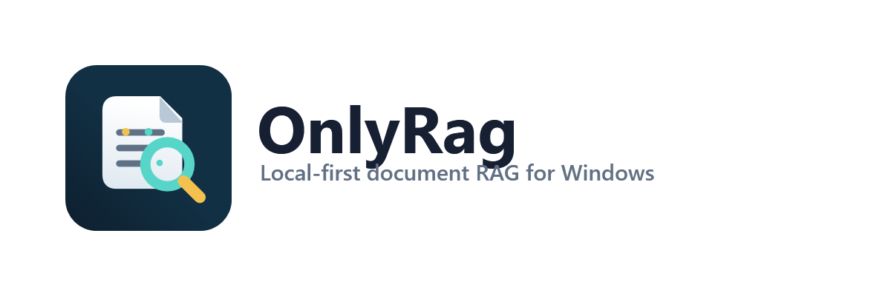

# OnlyRag

<p align="center">
  
</p>

[](https://github.com/dennidalpos/OnlyRag/actions/workflows/ci.yml)

OnlyRag is a Windows desktop app for a local document library with Ollama-backed search, chat,
OCR, and translation workflows.

The app is local-first. Documents, indexes, jobs, settings, chat history, OCR cache, logs,
WebView2 profile data, and exports live under `%LOCALAPPDATA%\OnlyRag`. Ollama can run locally or
on a trusted LAN endpoint. RAG answers send retrieved snippets to the model, not full source
documents.

## Supported Capabilities

- Import TXT, Markdown, CSV, PDF, DOCX, XLSX, PPTX, and image files.
- Run OCR for scanned PDFs and images through the PaddleOCR bridge when Python OCR prerequisites
  are available.
- Generate embeddings through a configured Ollama endpoint and store vectors in Qdrant.
- Search selected documents with SQLite FTS plus Qdrant vector retrieval.
- Chat with selected documents and show grounded source snippets.
- Translate indexed documents, edit page-based translation units, and export TXT, Markdown, HTML,
  DOCX, or PDF output.
- Configure Ollama, Qdrant, OCR, PDF export, ingestion, models, `num_ctx`, and performance
  from the desktop UI.
- Track ingestion, embedding, OCR, translation, and Ollama model-install jobs.
- Confirm app exit when local jobs or unsaved UI work exist.
- Build, test, package, sign, and verify Windows installer candidates with repository scripts.

## Requirements

Development machine:

- Windows 10 version 1809/build 17763 or newer, or Windows 11.
- PowerShell 7 (`pwsh`).
- .NET 10 SDK. `global.json` pins SDK selection with .NET 10 feature roll-forward.
- Node.js `^20.19.0 || >=22.12.0` with npm.
- Microsoft Edge WebView2 Runtime.

Optional development/runtime tools:

- Ollama for model features.
- LibreOffice for translation PDF export.
- Python 3.10 through 3.13 for PaddleOCR provisioning. Python 3.14 is not supported by the pinned
  PaddlePaddle runtime.
- Inno Setup 6 for installer generation.
- Windows 10/11 SDK `signtool.exe` and a trusted code-signing certificate for signed installers.

Installed app:

- Windows 10 version 1809/build 17763 or newer, or Windows 11.
- Microsoft Edge WebView2 Runtime.
- No separate .NET install is required; the installer is self-contained for required .NET runtime
  components and includes the bundled Qdrant runtime.

## Fresh Checkout

Run PowerShell 7 from the repository root:

```powershell
pwsh .\scripts\Bootstrap-Prerequisites.ps1
pwsh .\scripts\Build-Web.ps1
dotnet run --project .\src\OnlyRag.App\OnlyRag.App.csproj --configuration Debug
```

`Bootstrap-Prerequisites.ps1` verifies Windows, PowerShell, .NET, WebView2, Node/npm, optional
Ollama, optional LibreOffice, integrated image model storage, creates
`%LOCALAPPDATA%\OnlyRag`, restores .NET packages, installs web dependencies, and prepares OCR when
supported Python is available.

`Build-Web.ps1` creates `src\OnlyRag.Web\dist`, which the WPF shell uses when no Vite development
server is configured.

For frontend development with the Vite dev server:

```powershell
Set-Location .\src\OnlyRag.Web
npm run dev
```

In another PowerShell session, set `ONLYRAG_WEB_DEV_SERVER` to the loopback Vite URL and start the
desktop app:

```powershell
$env:ONLYRAG_WEB_DEV_SERVER = "http://127.0.0.1:5173"
dotnet run --project .\src\OnlyRag.App\OnlyRag.App.csproj --configuration Debug
```

Only loopback `http` or `https` URLs without embedded credentials are accepted.

## Commands

Run from the repository root with PowerShell 7 unless the command explicitly changes directory.

| task | command |
|---|---|
| Setup dependencies | `pwsh .\scripts\Bootstrap-Prerequisites.ps1` |
| Start desktop app | `dotnet run --project .\src\OnlyRag.App\OnlyRag.App.csproj --configuration Debug` |
| Start Vite dev server | `Set-Location .\src\OnlyRag.Web; npm run dev` |
| Check application readiness | `pwsh .\scripts\Invoke-Gate.ps1 -Configuration Release` |
| Check package build readiness | `pwsh .\scripts\Invoke-Gate.ps1 -Configuration Release -IncludeInstaller` |
| Build web UI | `pwsh .\scripts\Build-Web.ps1` |
| Build desktop app | `pwsh .\scripts\Build-App.ps1 -Configuration Release` |
| Build unsigned installer | `pwsh .\scripts\Build-Installer.ps1 -Configuration Release` |
| Sign installer | `pwsh .\scripts\Sign-Release.ps1 -CertificateThumbprint <thumbprint>` |
| Verify signed installer lifecycle | `pwsh .\scripts\Test-InstallerRelease.ps1 -InstallerPath .\artifacts\installer\OnlyRag-Setup-0.1.0-win-x64.exe -RequireSigned -RunInstallLifecycle` |
| Clean generated outputs | `pwsh .\scripts\Clean.ps1` |

Direct frontend checks:

```powershell
Set-Location .\src\OnlyRag.Web
npm run typecheck
npm run lint
npm run format:check
npm run test
```

Direct .NET tests:

```powershell
dotnet test .\OnlyRag.sln --configuration Release
```

## Readiness Gates

Application readiness:

```powershell
pwsh .\scripts\Invoke-Gate.ps1 -Configuration Release
```

This gate runs preflight checks, web dependency restore, .NET restore, npm production dependency
audit, NuGet transitive vulnerability audit, frontend typecheck/lint/format/tests, .NET tests,
installer prerequisite self-test, OCR runtime manifest checks, web build, and .NET build. CI runs
this same gate on `windows-latest`.

Package build readiness:

```powershell
pwsh .\scripts\Invoke-Gate.ps1 -Configuration Release -IncludeInstaller
```

This requires Inno Setup 6 and compiles the installer.

Production release readiness requires all of these:

- `Invoke-Gate.ps1 -Configuration Release -IncludeInstaller` passed.
- Installer is signed with `Sign-Release.ps1` or `Build-Installer.ps1 -SigningCertificateThumbprint`.
- `Test-InstallerRelease.ps1 -RequireSigned -RunInstallLifecycle` passed on a clean representative
  Windows profile or verification machine.
- Representative Ollama, OCR, Qdrant, integrated image model download/generation, and translation
  PDF export through LibreOffice runtime behavior were checked for the target deployment scope.

An unsigned installer, or a signed installer without lifecycle evidence, is not production-ready.

## Runtime Configuration

Required environment variables: none.

Supported optional environment variables:

- `ONLYRAG_WEB_DEV_SERVER`: Debug-only WebView2 source override. Must be a loopback `http` or
  `https` URL without embedded credentials.
- `ONLYRAG_LIBREOFFICE_PATH`: full path to `soffice.exe` when LibreOffice for translation PDF
  export is installed outside standard Windows locations.

User data:

- `%LOCALAPPDATA%\OnlyRag`: documents, SQLite data, Qdrant data, jobs, settings, logs, OCR cache,
  WebView2 profile data, and exports.
- `%LOCALAPPDATA%\Programs\OnlyRag`: default installed application path.

Generated repository outputs ignored by Git:

- `src\OnlyRag.Web\dist`
- `src\OnlyRag.Web\node_modules`
- project `bin` and `obj` folders
- `packaging\qdrant\payload`
- `artifacts`
- frontend and Playwright test output folders

Use `pwsh .\scripts\Clean.ps1` when generated outputs are no longer needed. Build and gate
commands recreate required ignored outputs.

## Troubleshooting

- Missing .NET SDK: install the official .NET 10 SDK for Windows and verify with
  `dotnet --list-sdks`.
- Missing Node/npm: install official Node.js 20.19.x or 22.12+ for Windows and verify with
  `node --version` and `npm --version`.
- Missing WebView2 Runtime: install Microsoft Edge WebView2 Evergreen Runtime and verify from
  Windows Settings > Apps or by locating `msedgewebview2.exe` under
  `Program Files\Microsoft\EdgeWebView\Application`.
- Missing Inno Setup: install Inno Setup 6 and verify with `ISCC.exe /?`, or pass
  `-InnoSetupCompiler` where supported.
- Missing signing tools: install Windows 10/11 SDK and verify with `signtool.exe /?`, or pass
  `-SignToolPath` where supported.
- Installer lifecycle blocked: rerun verification on a clean Windows profile or machine with
  WebView2 installed and pass the exact signed installer path to `Test-InstallerRelease.ps1`.
- OCR unavailable: install Python 3.10, 3.11, 3.12, or 3.13, then rerun bootstrap or use the OCR
  action in Settings.
- Ollama unavailable: install/start Ollama or configure a trusted LAN endpoint in Settings.
- Image generation unavailable: open Images, download the selected integrated model, verify the
  SHA256 status, and retry. DirectML GPU is preferred when available, including on NVIDIA GPUs; CPU
  fallback is supported.
- LibreOffice unavailable: install LibreOffice or set `ONLYRAG_LIBREOFFICE_PATH` to enable
  translation PDF export.

## Documentation

- [Documentation index](docs/README.md)
- [Operations and handoff](docs/OPERATIONS.md)
- [Architecture](docs/ARCHITECTURE.md)
- [Application flow](docs/APP_FLOW.md)
- [Scripts](scripts/README.md)
- [Brand assets](docs/BRAND_ASSETS.md)
- [RAG pipeline](docs/RAG_PIPELINE.md)
- [OCR pipeline](docs/OCR_PIPELINE.md)
- [Image generation](docs/IMAGE_GENERATION.md)
- [Office ingestion](docs/OFFICE_INGESTION.md)
- [Translation pipeline](docs/TRANSLATION_PIPELINE.md)
- [Signing](docs/SIGNING.md)
- [Packaging](packaging/README.md)
- [Operational tracker](PROJECT_STATUS.json)
