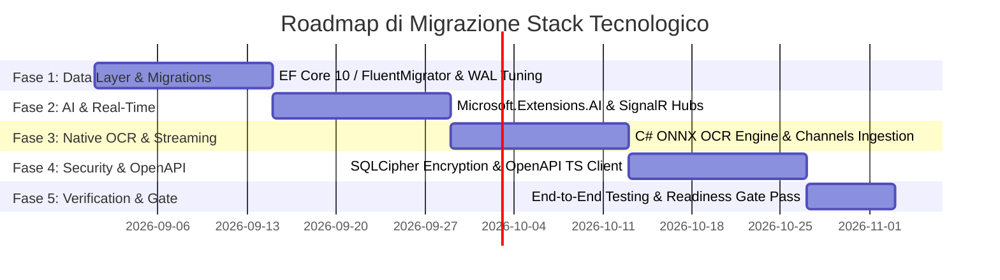

# Piano di Elevazione Stack Tecnologico per OnlyRag

## Executive Summary

OnlyRag è un'applicazione desktop Windows *local-first* basata su un'architettura ibrida:
- **Shell Desktop**: Windows Presentation Foundation (WPF) in **.NET 10** (`net10.0-windows`).
- **Frontend UI**: **React 19**, **TypeScript 5.9**, **Vite 6** e **TanStack Query v5**, integrato tramite Microsoft Edge **WebView2** runtime.
- **Backend**: In-process ASP.NET Core Minimal API in esecuzione all'interno dell'applicazione WPF su server Kestrel in loopback (`127.0.0.1`).
- **Database & System of Record**: **SQLite** tramite ADO.NET basico (`Microsoft.Data.Sqlite` 10.0.10 e `SQLitePCLRaw.bundle_e_sqlite3` 2.1.12) con FTS5 per la ricerca testuale.
- **Vector Store**: **Qdrant** (client `Qdrant.Client` 1.18.1) eseguito via processo locale affiancato (*sidecar binary*).
- **Elaborazione Documenti**: `PdfPig` (PDF), `DocumentFormat.OpenXml` (DOCX/XLSX/PPTX), `SharpCompress` (Archivi).
- **AI & OCR Bridge**: Integratione Ollama HTTP personalizzata, ponte subprocess Python per **PaddleOCR** (`scripts/ocr`), e **ONNX Runtime DirectML** (`Microsoft.ML.OnnxRuntime.DirectML` 1.24.4 + `OnnxStack.StableDiffusion` 0.60.0) per la generazione locale di immagini.

Questo documento definisce un **audit architetturale completo** e un **piano di elevazione tecnologica** strutturato per eliminare il debito tecnico, introdurre le più recenti astrazioni .NET 10 e web moderni, rafforzare la sicurezza a riposo e massimizzare le prestazioni complessive.

---

## 1. Stato Attuale e Debito Tecnico

### 1.1 Data Access Layer (SQLite & Persistence)
* **Gestione Manuale ADO.NET**: L'accesso al database avviene tramite comandi SQL scritti a mano ed estensioni custom (`SqliteCommandExtensions.cs`, `SqliteDocumentRepository.cs`, `SqliteTranslationRepository.cs`, etc.). Mancano costrutti fortemente tipizzati e ottimizzati forniti da un ORM moderno (es. EF Core 10 o Dapper).
* **Strategia di Migrazione Distruttiva**: Il file di inizializzazione dello schema (`LocalSqliteSchemaInitializer.cs`, oltre 1100 righe) rileva differenze di versione dello schema. Se la versione locale non corrisponde perfettamente alla versione target (`CurrentSchemaVersion = 11`), il sistema effettua un backup e ricrea lo schema da zero (`ResetAndCreateFreshSchemaAsync`). Questo approccio comporta un elevato rischio di perdita dati e necessita di essere sostituito con migrazioni incrementali non distruttive (FluentMigrator / EF Core Migrations).
* **Assenza di Concurrency Tuning & Connection Pooling**: SQLite viene aperto e chiuso singolarmente per ogni operazione senza un'ottimizzazione sistematica dei PRAGMA (es. `WAL` mode, `synchronous=NORMAL`, `cache_size`, `busy_timeout`).

### 1.2 Comunicazione Frontend-Backend e Real-Time Streaming
* **Polling HTTP REST per i Job**: Il frontend React effettua polling periodico su `/api/jobs` per aggiornare lo stato di ingestion, OCR, embedding e traduzione. Questo genera overhead inutile di CPU e ritardi nella UI.
* **Mancanza di Streaming Token LLM**: Le risposte del modello di linguaggio (Ollama) e i log dei job non sfruttano protocolli di streaming in tempo reale come **ASP.NET Core SignalR** o **Server-Sent Events (SSE)**.
* **Contract Tipizzato Manuale**: I tipi API tra frontend (`src/OnlyRag.Web/src/types`) e backend C# (`OnlyRag.Core`) sono sincronizzati manualmente invece di essere generati automaticamente da specifiche **OpenAPI / NSwag**.

### 1.3 Modelli AI, Vector Engine & OCR Dependencies
* **Client HTTP Ollama Custom**: L'integrazione con Ollama si basa su chiamate `HttpClient` scritte ad-hoc (`OllamaClient.cs`) invece di utilizzare la nuova astrazione standard **`Microsoft.Extensions.AI`** (`IChatClient`, `IEmbeddingGenerator`) integrata nell'ecosistema .NET.
* **Dipendenza Esterna da Python per PaddleOCR**: L'ingestion di PDF scansionati e immagini dipende da un ponte verso un ambiente Python esterno (`OcrPythonRuntime.cs`, `OcrProvisionRuntimeResolver.cs`). Questo richiede l'installazione di Python 3.10-3.13 sull'host, introduce fragilità per incompatibilità di runtime (es. Python 3.14 non supportato) e overhead di IPC via subprocess.
* **Vector Store via Processo Esterno**: Qdrant viene eseguito come processo nativo bundle/sidecar gestito da `QdrantProcessSupervisor.cs`. Sebbene prestazionale, la gestione del ciclo di vita via IPC richiede socket/porte locali e contratti di shutdown complessi.

### 1.4 Pipeline di Ingestion Documentale e Memoria
* **Caricamento In-Memory**: Molti parser documentali caricano interi file e collezioni di pagine in memoria prima del chunking e dell'embedding, creando picchi di memoria RAM durante l'importazione di documenti voluminosi.

### 1.5 Sicurezza e Crittografia dei Dati
* **Dati a Riposo non Crittografati**: Il database SQLite e la directory dei documenti locali (%LOCALAPPDATA%\OnlyRag) sono salvati in chiaro sul filesystem dell'utente. Sebbene sia presente `AesBackupService.cs` per i backup esportati, la persistenza a riposo non offre crittografia trasparente del DB.

---

## 2. Proposte di Modernizzazione (Librerie e Pattern)

```
[ Frontend: React 19 + TypeScript ] 
         │ (SignalR WebSockets / OpenAPI TS Client)
         ▼
[ In-Process Backend: .NET 10 Minimal API + SignalR Hubs ]
         │
 ┌───────┴──────────────────────────────────────────────┐
 │                                                      │
 ▼                                                      ▼
[ Data Layer: EF Core 10 / Dapper ]          [ Microsoft.Extensions.AI ]
 │ + SQLCipher (Encrypted SQLite)             │ (IChatClient / IEmbeddingGenerator)
 │ + FluentMigrator / EF Migrations           ├───────────────┬────────────────┐
 ▼                                            ▼               ▼                ▼
[ SQLite DB (WAL Mode) ]                 [ Ollama API ]  [ Native ONNX ]  [ Qdrant gRPC ]
                                                         (OCR DirectML)   (Vector Store)
```

### 2.1 Modernizzazione Data Layer: Entity Framework Core 10 / Dapper + FluentMigrator
* **Proposta**: Adottare **Entity Framework Core 10** (o in alternativa **Dapper** per query ad alte prestazioni unito a **FluentMigrator**) per gestire l'accesso a SQLite.
* **Benefici**:
  - Eliminazione di righe SQL string interpolate e di `SqliteCommandExtensions.cs`.
  - Gestione automatizzata e **non distruttiva** delle migrazioni del database (`dotnet ef migrations add` o `FluentMigrator.Runner`).
  - Mappatura fortemente tipizzata tra entità C# e tabelle SQLite.

### 2.2 Standardizzazione AI: `Microsoft.Extensions.AI` & Semantic Kernel Integration
* **Proposta**: Sostituire le classi custom `OllamaClient.cs` con il pacchetto standard Microsoft **`Microsoft.Extensions.AI`** (`IChatClient`, `IEmbeddingGenerator`).
* **Benefici**:
  - Uniformità nell'integrazione di qualsiasi provider LLM (Ollama, Azure OpenAI, Local ONNX, Anthropic) senza cambiare la business logic.
  - Supporto nativo a middleware per logging, caching, retry (Polly) e telemetry via OpenTelemetry.
  - Predisposizione per **Kernel Memory** o pipeline di RAG standardizzate.

### 2.3 Comunicazione Real-Time: ASP.NET Core SignalR Hubs
* **Proposta**: Introdurre **ASP.NET Core SignalR** per collegare il backend Kestrel con il frontend WebView2 React via WebSocket / In-Process Message Bus.
* **Benefici**:
  - **Streaming Token LLM**: Risposte della chat visualizzate carattere per carattere in tempo reale.
  - **Live Job Feedback**: Progress bar di Ingestion, Embedding, OCR e Generazione Immagini aggiornate istantaneamente senza polling HTTP.

### 2.4 Bridge API Tipizzato: Generatione Client OpenAPI / TypeScript
* **Proposta**: Integrare **NSwag** o `Microsoft.AspNetCore.OpenApi` nel backend .NET e **`@hey-api/openapi-ts`** (o `openapi-typescript`) nel frontend `OnlyRag.Web`.
* **Benefici**:
  - TypeScript interfaces e metodi di chiamata API rigenerati automaticamente durante la build di .NET.
  - Garanzia al 100% della corrispondenza dei contratti DTO tra backend C# e UI React.

### 2.5 OCR Migrations: Engine OCR Nativo C# ONNX (Eliminazione Python)
* **Proposta**: Sostituire il bridge Python PaddleOCR con un binding C# nativo su base **ONNX Runtime DirectML** (es. **`PaddleOCR.NET`** o **`Tesseract.NET`** in-process).
* **Benefici**:
  - Eliminazione della dipendenza da Python 3.x sull'ambiente dell'utente finale.
  - Riduzione drastica dell'impronta dell'installer e velocizzazione dei tempi di inizializzazione dell'OCR.
  - Piena compatibilità GPU via DirectML già presente nel progetto per l'Image Generation.

### 2.6 Pipeline Ingestion Documentale: `System.Threading.Channels`
* **Proposta**: Riconfigurare la pipeline di ingestion dei documenti per utilizzare **`System.Threading.Channels`** (pattern Producer-Consumer asincrono a basso consumo di memoria).
* **Benefici**:
  - Parsing del documento -> Chunking -> Generazione Embedding -> Inserimento Vector DB eseguiti in streaming senza caricare l'intero file in RAM.

---

## 3. Ottimizzazioni di Sicurezza e Performance

### 3.1 Sicurezza
1. **Crittografia del Database a Riposo (SQLCipher)**:
   - Sostituire `SQLitePCLRaw.bundle_e_sqlite3` con **`SQLitePCLRaw.bundle_e_sqlcipher`**.
   - Integrare la crittografia transparente AES-256 del database SQLite tramite una chiave crittografica memorizzata nel Windows Credential Manager.
2. **Lockdown API & Isolation**:
   - Limitare in modo rigoroso l'ascolto di Kestrel all'interfaccia di loopback `127.0.0.1` con generazione dinamica di un Secret Header/Token scambiato tra la finestra WPF e WebView2 per prevenire chiamate non autorizzate da altri processi locali.
3. **Strict Path Traversal Guards**:
   - Enforce rigoroso su `SafeDocumentPath.cs` usando `Path.GetFullPath` e comparazione di prefissi canonici per impedire accessi a file fuori da `%LOCALAPPDATA%\OnlyRag`.

### 3.2 Performance
1. **SQLite WAL Mode & PRAGMA Tuning**:
   - Abilitare nativamente all'apertura delle connessioni:
     ```sql
     PRAGMA journal_mode = WAL;
     PRAGMA synchronous = NORMAL;
     PRAGMA cache_size = -64000; -- 64MB Cache
     PRAGMA temp_store = MEMORY;
     PRAGMA busy_timeout = 5000;
     ```
2. **Batch Embedding & Vector Store Index Caching**:
   - Ottimizzare la chiamata a `Qdrant.Client` raggruppando i vettori in batch da 64-128 elementi in gRPC.
3. **Gestione Memoria VRAM ONNX DirectML**:
   - Implementare un `VramMemoryManager` per allocare e disallocare esplicitamente le sessioni ONNX di Stable Diffusion/OCR quando inattive per evitare frammentazione della memoria della GPU.
4. **Frontend Code-Splitting & Web Workers**:
   - Separare i bundle React mediante lazy loading e spostare il parsing dei file Markdown e l'evidenziazione della sintassi (`rehype-highlight`) all'interno di un **Web Worker**.

---

## 4. Roadmap Step-by-Step per una Migrazione Sicura



### Fase 1: Modernizzazione Data Layer & Schema Migrations (Settimane 1-2)
- **Obiettivo**: Eliminare il codice SQL manuale e la migrazione distruttiva dello schema.
- **Passi**:
  1. Aggiungere il riferimento a EF Core 10 (`Microsoft.EntityFrameworkCore.Sqlite`) in `OnlyRag.Infrastructure`.
  2. Definire `OnlyRagDbContext` con le entità per `Document`, `Chunk`, `Job`, `Setting`, `Translation`, `ChatHistory`.
  3. Generare la migrazione iniziale non distruttiva e sostituire `LocalSqliteSchemaInitializer.cs` con `dbContext.Database.MigrateAsync()`.
  4. Configurare le PRAGMA SQLite per la modalità WAL.
- **Verifica**: Eseguire `dotnet test .\tests\OnlyRag.Infrastructure.Tests` e verificare la conservazione dei dati tra aggiornamenti di schema.

### Fase 2: Standardizzazione `Microsoft.Extensions.AI` & Real-Time SignalR (Settimane 3-4)
- **Obiettivo**: Introdurre lo streaming real-time per LLM e stato dei job; adottare l'astrazione AI standard.
- **Passi**:
  1. Registrare `IChatClient` e `IEmbeddingGenerator` fornite da `Microsoft.Extensions.AI.Ollama` in `InProcessBackend.ServiceRegistration.cs`.
  2. Creare SignalR Hubs (`JobProgressHub`, `ChatStreamHub`) in `OnlyRag.Api`.
  3. Collegare il frontend React tramite `@microsoft/signalr` per la ricezione in streaming dei token e del progresso dei job.
- **Verifica**: Testare l'interfaccia di chat per verificare la visualizzazione fluida del testo generato e l'assenza di polling REST su `/api/jobs`.

### Fase 3: OCR Nativo C# ONNX & Channel Pipelines (Settimane 5-6)
- **Obiettivo**: Rimuovere la dipendenza da Python e rendere l'ingestion in grado di gestire file voluminosi a basso consumo di memoria.
- **Passi**:
  1. Sostituire il ponte Python `scripts/ocr` con un motore ONNX C# nativo caricato direttamente tramite DirectML.
  2. Riscrivere `DocumentIngestionJobHandler.cs` usando `System.Threading.Channels` per la pipeline `Reader -> Chunker -> Embedder -> VectorStoreWriter`.
- **Verifica**: Verificare l'esecuzione dell'OCR su un'installazione Windows pulita priva di Python.

### Fase 4: Security Hardening & Typed OpenAPI Client (Settimane 7-8)
- **Obiettivo**: Crittografare i dati a riposo e garantire contratti API al 100% tipizzati.
- **Passi**:
  1. Abilitare **SQLCipher** in EF Core / SQLite.
  2. Configurare `Microsoft.AspNetCore.OpenApi` ed eseguire la generazione di contratti TypeScript nel frontend con `@hey-api/openapi-ts`.
  3. Rafforzare la convalida dei percorsi in `SafeDocumentPath.cs`.
- **Verifica**: Audit di sicurezza sulle chiamate API e test di apertura del file DB con un normale client SQLite (deve risultare crittografato).

### Fase 5: Collaudo, Benchmarking & Gate Release (Settimana 9)
- **Obiettivo**: Convalidare le prestazioni, la stabilità e la prontezza del pacchetto di rilascio.
- **Passi**:
  1. Eseguire l'intero gate di test: `pwsh .\scripts\Invoke-Gate.ps1 -Configuration Release -IncludeInstaller`.
  2. Effettuare benchmark sulla latenza di risposta RAG, utilizzo di RAM/CPU durante l'ingestion e tempi di avvio dell'app desktop.
  3. Verificare la corretta firma e il ciclo di vita dell'installer con `Test-InstallerRelease.ps1`.
