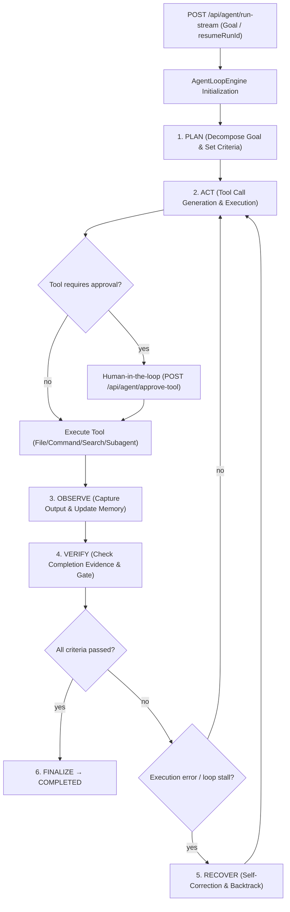

# Autonomous Agent Engine (SOTA Edition)

OnlyRag features a fully autonomous, local-first software development and problem-solving agent engine built directly into the C# ASP.NET Core in-process backend (`src/OnlyRag.Api`) and backed by SQLite persistence (`src/OnlyRag.Infrastructure`).

---

## Architecture Flow

---

## Key Components

### 1. Loop Engine & Phase Machine
- **[`AgentLoopEngine.cs`](../src/OnlyRag.Api/AgentLoopEngine.cs)**: Drives the agent execution loop through strict phase state transitions:
  - **`Plan`**: Analyzes the goal, loads relevant memory/skills, and breaks down work into structured steps.
  - **`Act`**: Generates structured tool calls or responses via the configured Ollama model.
  - **`Observe`**: Captures tool results, command outputs, file diffs, or subagent outputs and updates context.
  - **`Verify`**: Validates runtime-observed evidence (test results, build status, file modifications) against explicit completion criteria. `COMPLETED` phase is blocked until verification passes.
  - **`Recover`**: Intercepts repeated cycle stalls, missing dependencies, or tool failures to auto-correct tactics.
  - **`Finalize`**: Records final execution summaries, trace events, and updates persistent run state.

### 2. Subagent DAG Orchestration
- **[`SubagentRunner.cs`](../src/OnlyRag.Api/SubagentRunner.cs)**: Handles parallel subagent invocation and DAG dependency execution (`invoke_subagent` tool):
  - Supports spawning specialized subagents concurrently or in a dependency graph.
  - Enforces recursion depth limits to prevent infinite subagent nesting.
  - Channels subagent step events real-time back to the parent agent execution stream.
  - Persists subagent summaries and structured findings in `subagent_report_cache`.

### 3. Memory & Skill System
- **[`AgentMemoryManager.cs`](../src/OnlyRag.Api/AgentMemoryManager.cs)**: Manages short-term working context, key facts, and long-term episodic memory.
- **SQLite Storage Tables**:
  - `agent_episodic_memories`: Stores historical task execution patterns, successful solutions, and recovery strategies.
  - `agent_skills`: Stores reusable skill procedures and domain workflows.
  - `subagent_report_cache`: Caches subagent outputs for reference during multi-agent orchestrations.

### 4. Tool Call Parser & Execution
- **[`AgentToolCallParser.cs`](../src/OnlyRag.Api/AgentToolCallParser.cs)**: Parses tool calls from standard JSON or XML format output by LLM models.
- **Supported Tool Types**:
  - `view_file`, `write_to_file`, `replace_file_content`, `multi_replace_file_content`
  - `run_command` (PowerShell command execution with async task streaming)
  - `search_web` / RAG retrieval
  - `invoke_subagent` (DAG subagent delegation)
  - `plan_task`, `reflect_step` (Internal state and checklist management)

### 5. Policy Audit & MCTS Checkpoints
- **[`AgentPolicyAuditLogger.cs`](../src/OnlyRag.Api/AgentPolicyAuditLogger.cs)**: Logs security-sensitive tool invocations (command executions, file writes) to `agent_policy_audit_logs`.
- **MCTS Checkpoint Repository**: Saves branch search snapshots to `agent_mcts_checkpoints` for complex multi-step plan rollbacks and tree searches.

---

## API Endpoints

| Endpoint | Method | Description |
|---|---|---|
| `/api/agent/run-stream` | POST | Starts or resumes an agent run with Server-Sent Events (SSE) streaming output. |
| `/api/agent/approve-tool` | POST | Submits human approval/rejection for gated tool executions. |
| `/api/agent/runs/{runId}` | GET | Returns snapshot details and current phase status for a specific run. |
| `/api/agent/runs/resumable` | GET | Lists non-terminal runs that can be resumed after application restart. |
| `/api/agent/runs/{runId}/trace` | GET | Retrieves full immutable event trace (`agent_run_trace_events`) for audit. |
| `/api/agent/runs/{runId}/evaluation` | GET | Evaluates run performance metrics against benchmark expectations. |
| `/api/agent/policy-audit` | GET | Queries policy audit logs for security compliance verification. |
| `/api/agent/orchestrate` | POST | Submits a multi-agent orchestration workflow. |
| `/api/agent/orchestrate/{id}` | GET | Fetches status for a multi-agent orchestration session. |

---

## Benchmark & Evaluation

- Evaluation dataset: [`docs/agent-evaluation.dataset.json`](agent-evaluation.dataset.json).
- Defines repeatable task goals, expected step counts, latency limits, and success criteria for continuous agent engine benchmark testing.
