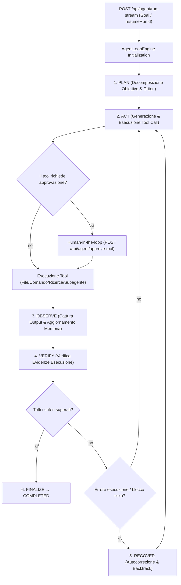

# Motore Agenti Autonomi (Edizione SOTA)

OnlyRag include un motore per agenti autonomi di sviluppo software e problem solving local-first integrato direttamente nel backend C# ASP.NET Core in-process (`src/OnlyRag.Api`) e supportato dalla persistenza SQLite (`src/OnlyRag.Infrastructure`).

---

## Flusso dell'Architettura

---

## Componenti Chiave

### 1. Loop Engine & Macchina a Stati (Phase Machine)
- **[`AgentLoopEngine.cs`](../src/OnlyRag.Api/AgentLoopEngine.cs)**: Gestisce il ciclo principale dell'agente.
- **[`PersistentAgentRunStateMachine.cs`](../src/OnlyRag.Infrastructure/Agent/PersistentAgentRunStateMachine.cs)** e **[`AgentMctsStateMachine.cs`](../src/OnlyRag.Infrastructure/Agent/AgentMctsStateMachine.cs)**: Eseguono le transizioni di fase rigide e la ricerca Monte Carlo Tree Search (MCTS):
  - **`Plan`**: Analizza l'obiettivo, carica memorie/skill rilevanti e scompone il lavoro in passaggi strutturati.
  - **`Act`**: Genera invocazioni tool strutturate o risposte tramite il modello Ollama o Cloud LLM configurato.
  - **`Observe`**: Cattura i risultati dei tool, l'output dei comandi, i diff dei file o i report dei subagenti ed aggiorna il contesto.
  - **`Verify`**: Convalida le evidenze osservate a runtime (risultati dei test, stato delle build, modifiche file) rispetto ai criteri espliciti via [`AgentVerificationEngine`](../src/OnlyRag.Infrastructure/Agent/AgentVerificationEngine.cs). La fase `COMPLETED` è bloccata fino al superamento della verifica.
  - **`Recover`**: Intercetta blocchi ripetuti o fallimenti di tool per autocorregere le tattiche dell'agente.
  - **`Finalize`**: Registra i riepiloghi finali dell'esecuzione, gli eventi di traccia e aggiorna lo stato persistente in SQLite.

### 2. Orchestrazione Subagenti DAG e Multi-Agente
- **[`SubagentRunner.cs`](../src/OnlyRag.Api/SubagentRunner.cs)** e **[`MultiAgentOrchestratorService.cs`](../src/OnlyRag.Infrastructure/Agent/MultiAgentOrchestratorService.cs)**: Gestiscono l'invocazione parallela dei subagenti e l'esecuzione dei grafi di dipendenza DAG (`invoke_subagent` tool):
  - Supporta lo spawning di subagenti specializzati in parallelo o in un grafo di dipendenze.
  - Impone limiti di profondità di ricorsione per evitare nidificazioni infinite.
  - Trasmette gli eventi di ciascun subagente in tempo reale al flusso di esecuzione principale.
  - Salva i report dei subagenti in `subagent_report_cache`.

### 3. Sistema di Memoria & Skill
- **[`AgentMemoryManager.cs`](../src/OnlyRag.Api/AgentMemoryManager.cs)** e servizi in [`src/OnlyRag.Infrastructure/Agent/Memory`](../src/OnlyRag.Infrastructure/Agent/Memory): Gestiscono il contesto di lavoro a breve termine, i fatti chiave, le skill apprese automaticamente (`SqliteAgentSkillRepository`, `AgentSkillAutoLearner`) e la memoria episodica a lungo termine (`SqliteQdrantEpisodicMemoryService`).
- **Tabelle SQLite**:
  - `agent_episodic_memories`: Memorizza i pattern di risoluzione storici e le strategie di recovery.
  - `agent_skills`: Memorizza procedure e workflow di dominio riutilizzabili.
  - `subagent_report_cache`: Memorizza in cache i report dei subagenti.

### 4. Tool Handlers ed Esecuzione
- **[`AgentToolCallParser.cs`](../src/OnlyRag.Api/AgentToolCallParser.cs)** e [`WorkspaceToolExecutor.cs`](../src/OnlyRag.Infrastructure/Agent/WorkspaceToolExecutor.cs): Effettuano il parsing e l'esecuzione coordinata dei tool tramite i gestori specializzati under [`src/OnlyRag.Infrastructure/Agent/Tools`](../src/OnlyRag.Infrastructure/Agent/Tools) (`FileSystemToolHandler`, `TaskAndCommandToolHandler`, `SearchAndInspectToolHandler`, `SubagentToolHandler`, `RefactorAndPlanningToolHandler`, `ExternalServicesToolHandler`).
- **Tool Supportati**:
  - `view_file`, `write_to_file`, `replace_file_content`, `multi_replace_file_content`
  - `run_command` (Esecuzione comandi PowerShell 7 con streaming asincrono)
  - `search_web` / Retrieval RAG
  - `invoke_subagent` (Delegazione a subagenti via DAG)
  - `plan_task`, `reflect_step` (Gestione dello stato interno e checklist)

### 5. Policy Audit & Safety
- **[`AgentExecutionPolicyService.cs`](../src/OnlyRag.Infrastructure/Agent/AgentExecutionPolicyService.cs)**: Verifica le policy di sicurezza dei tool e registra gli eventi di audit in `agent_run_trace_events`.

---

## Endpoints API

| Endpoint | Metodo | Descrizione |
|---|---|---|
| `/api/agent/run-stream` | POST | Avvia o riprende un run dell'agente con output in streaming Server-Sent Events (SSE). |
| `/api/agent/approve-tool` | POST | Invia l'approvazione/rifiuto umano per l'esecuzione di tool gated. |
| `/api/agent/runs/{runId}` | GET | Restituisce i dettagli dello snapshot e lo stato di fase per un run specifico. |
| `/api/agent/runs/resumable` | GET | Elenca i run non terminali riprendibili dopo il riavvio dell'applicazione. |
| `/api/agent/runs/{runId}/trace` | GET | Recupera la traccia immutabile completa degli eventi (`agent_run_trace_events`). |
| `/api/agent/runs/{runId}/evaluation` | GET | Valuta le metriche di prestazione del run rispetto al benchmark. |
| `/api/agent/policy-audit` | GET | Interroga i log di audit delle policy per la verifica di sicurezza. |
| `/api/agent/orchestrate` | POST | Invia un workflow di orchestrazione multi-agente. |
| `/api/agent/orchestrate/{id}` | GET | Recupera lo stato di una sessione di orchestrazione multi-agente. |

---

## Benchmark & Valutazione

- Dataset di valutazione: [`docs/agent-evaluation.dataset.json`](agent-evaluation.dataset.json).
- Definisce obiettivi di task ripetibili, numero di passaggi previsti, limiti di latenza e criteri di successo per il testing continuo del motore agenti.

