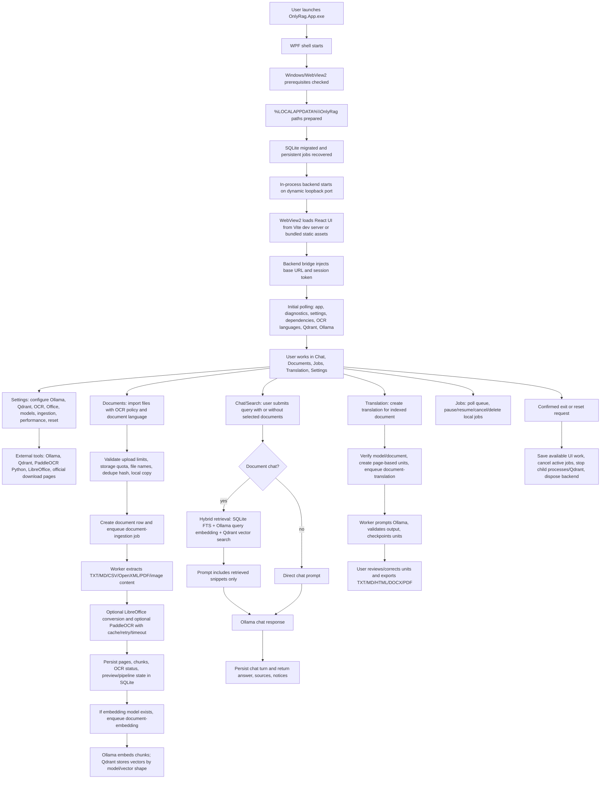

# Application Flow

The editable source diagram is [`APP_FLOW.drawio`](APP_FLOW.drawio). This Markdown page is the
text fallback for review and handoff.

## Startup

The WPF app validates Windows and WebView2, prepares app directories, starts the backend,
migrates SQLite, recovers local job state, initializes WebView2, and loads either bundled static
web assets or the loopback Vite development server in Debug builds. Non-loopback or
credential-bearing `ONLYRAG_WEB_DEV_SERVER` URLs are ignored.

## Initial Setup

The UI exposes dependency status and setup actions for Ollama, Qdrant, OCR, and LibreOffice. The
app opens official install pages for manual external installs where appropriate. OCR provisioning
uses repository runtime manifests and local Python when available. Qdrant settings distinguish
the bundled local runtime from trusted remote endpoints.

## Workflows

Document import validates local limits, creates local records, and enqueues persistent jobs.
Ingestion extracts text, optional OCR adds text for scanned/image content, embeddings are
generated through Ollama, and vector data is stored in Qdrant. Search and chat use selected
document scopes with hybrid SQLite FTS plus vector retrieval. Translation jobs generate editable
page-based units and exports.

## Shutdown

When local jobs or unsaved UI work exist, the app asks for confirmation. Confirmed exit saves
available work, cancels active local jobs, and shuts down the in-process backend.
