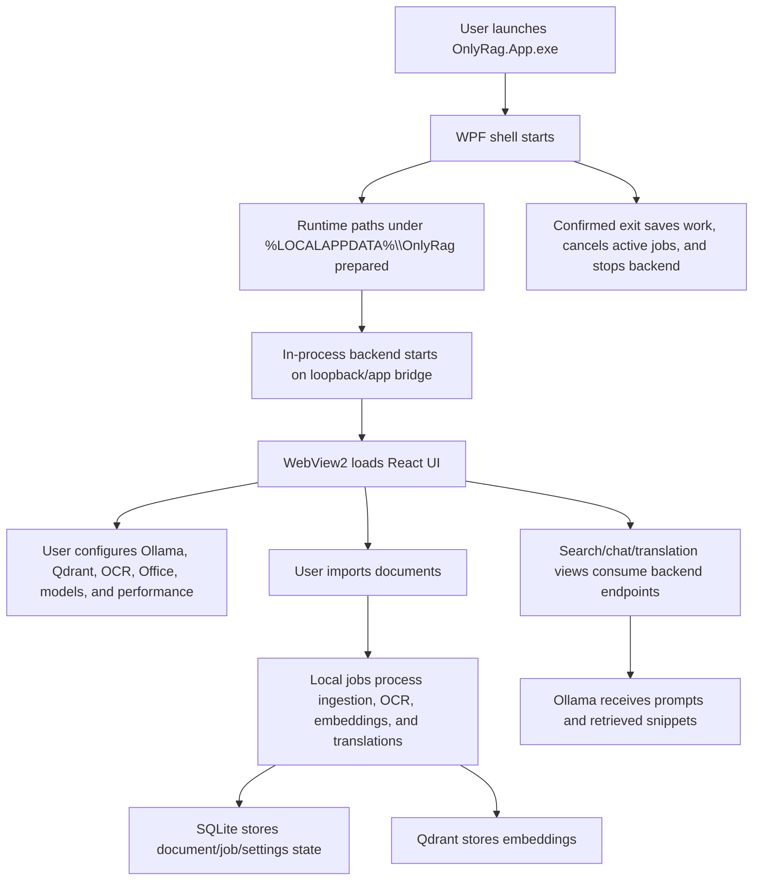

# Application Flow

The editable source diagram is [`APP_FLOW.drawio`](APP_FLOW.drawio). This Markdown page is the
text fallback for review and handoff.

## Startup

The WPF app validates the local runtime, prepares app directories, starts the backend, initializes
WebView2, and loads either bundled static web assets or the loopback Vite development server in
Debug builds. Non-loopback or credential-bearing `ONLYRAG_WEB_DEV_SERVER` URLs are ignored.

## Initial Setup

The UI exposes dependency status and setup actions for Ollama, Qdrant, OCR, and LibreOffice. The
app opens official install pages for manual external installs where appropriate. OCR provisioning
uses repository runtime manifests and local Python when available.

## Workflows

Document import creates local records and jobs. Ingestion extracts text, optional OCR adds text for
scanned/image content, embeddings are generated through Ollama, and vector data is stored in
Qdrant. Search and chat use selected document scopes. Translation jobs generate editable
page-based units and exports.

## Shutdown

When local jobs or unsaved UI work exist, the app asks for confirmation. Confirmed exit saves
available work, cancels active local jobs, and shuts down the in-process backend.
