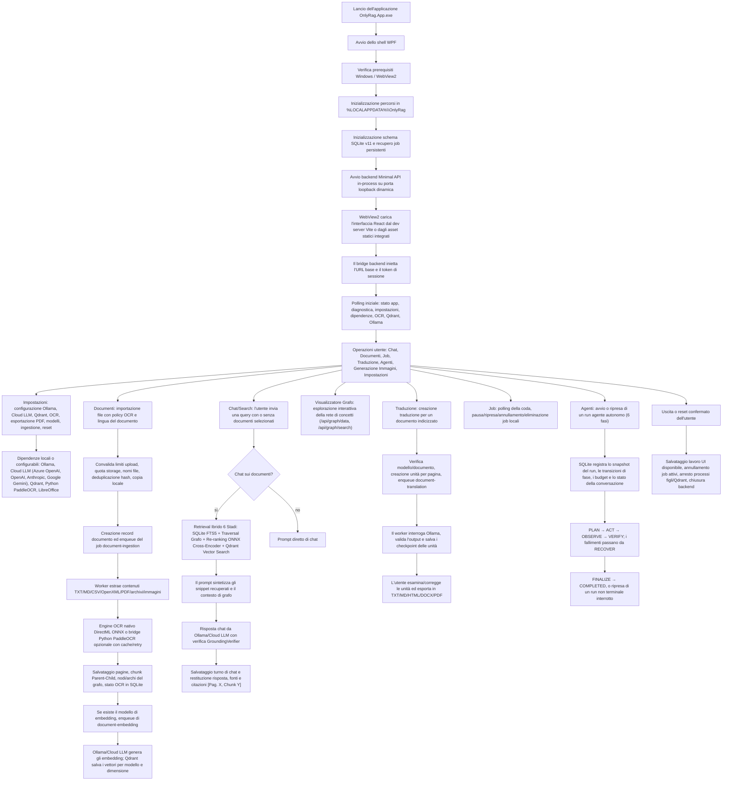

# Flusso dell'Applicazione

Il diagramma sorgente modificabile è [`APP_FLOW.drawio`](APP_FLOW.drawio). Questa pagina Markdown è il riferimento testuale completo.

## Avvio

L'applicazione WPF convalida l'ambiente Windows e WebView2, prepara le directory locali, avvia il backend in-process su una porta dinamica, inizializza il database SQLite tramite EF Core 10 (`OnlyRagDbContext` / `LocalSqliteSchemaInitializer`), ripristina lo stato dei job, inizializza gli hub SignalR (`ChatStreamHub`, `JobProgressHub`) e carica l'interfaccia React in WebView2.

## Workflow

- **Importazione Documenti**: Convalida limiti locali, estrazione testo nativa (OpenXML/PDF/TXT), OCR automatico per immagini/PDF scansionati, generazione embedding via Ollama e salvataggio vettori su Qdrant.
- **Ricerca e Chat RAG**: Pipeline a 6 stadi basata su SQLite FTS5, Qdrant HNSW, re-ranking ONNX Cross-Encoder (`OnnxCrossEncoderReRankerService`), Knowledge Graph Traversal e verifica runtime `GroundingVerifier`.
- **Agenti Autonomi**: Ciclo a 6 fasi (`Plan` → `Act` → `Observe` → `Verify` → `Recover` → `Finalize`) guidato da `AgentLoopEngine`, memoria episodica e verifiche empiriche dei tool.
- **Chiusura**: Annullo sicuro dei job attivi, salvataggio dello stato utente e arresto controllato dei processi figli.
