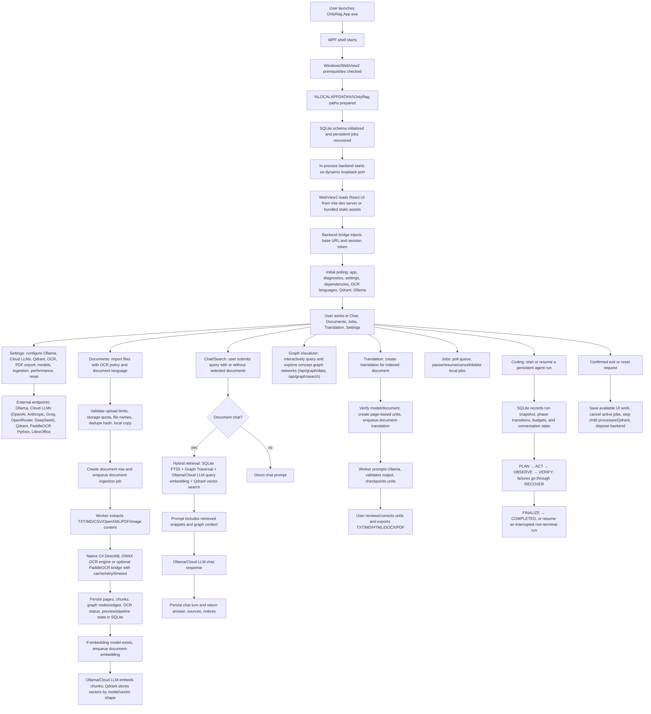

# Application Flow

The editable source diagram is [`APP_FLOW.drawio`](APP_FLOW.drawio). This Markdown page is the
text fallback for review and handoff.

## Startup

The WPF app validates Windows and WebView2, prepares app directories, starts the backend,
initializes the current SQLite schema, recovers local job state, initializes WebView2, and loads either bundled static
web assets or the loopback Vite development server in Debug builds. Non-loopback or
credential-bearing `ONLYRAG_WEB_DEV_SERVER` URLs are ignored.

## Initial Setup

The UI exposes dependency status and setup actions for Ollama, Qdrant, OCR, and LibreOffice for
PDF export. The app opens official install pages for manual external installs where appropriate.
OCR provisioning uses repository runtime manifests and local Python when available. Qdrant
settings distinguish the bundled local runtime from trusted remote endpoints.

## Workflows

Document import validates local limits, creates local records, and enqueues persistent jobs.
Ingestion extracts text, optional OCR adds text for scanned/image content, embeddings are
generated through Ollama, and vector data is stored in Qdrant. Search and chat use selected
document scopes with hybrid SQLite FTS plus vector retrieval. Translation jobs generate editable
page-based units and exports.

## Agent runs

Coding-agent runs are durable SQLite records. The runtime, rather than the model prompt, enforces
the `Plan`, `Act`, `Observe`, `Verify`, `Recover`, and `Finalize` phases. It persists the LLM
conversation snapshot and phase transitions after each action cycle, applies tool-call, estimated-token,
and wall-clock budgets, and exposes `GET /api/agent/runs/{runId}` plus
`GET /api/agent/runs/resumable` for recovery after an application restart. A new streaming request can
pass `resumeRunId` to continue a non-terminal run.

Every new run also persists typed completion criteria and runtime-observed verification evidence.
`FINALIZE` and `COMPLETED` are blocked until every required criterion has a successful matching tool
result. Command criteria may require an exact `run_command`; when omitted, the default criterion
accepts only a successful build, test, lint, typecheck, or release-gate command. Model claims and
`reflect_step` output are never treated as completion evidence.

## Agent evaluation traces

Every run appends immutable events to `agent_run_trace_events`: goal decision, phase, model response
latency, tool result, observations, errors, token usage, evidence and terminal outcome. Events are
available from `GET /api/agent/runs/{runId}/trace`. The committed
[`agent-evaluation.dataset.json`](agent-evaluation.dataset.json) defines repeatable real development
tasks and expected limits for success, regressions, duration and step count.

## Shutdown

When local jobs or unsaved UI work exist, the app asks for confirmation. Confirmed exit saves
available work, cancels active local jobs, and shuts down the in-process backend.
