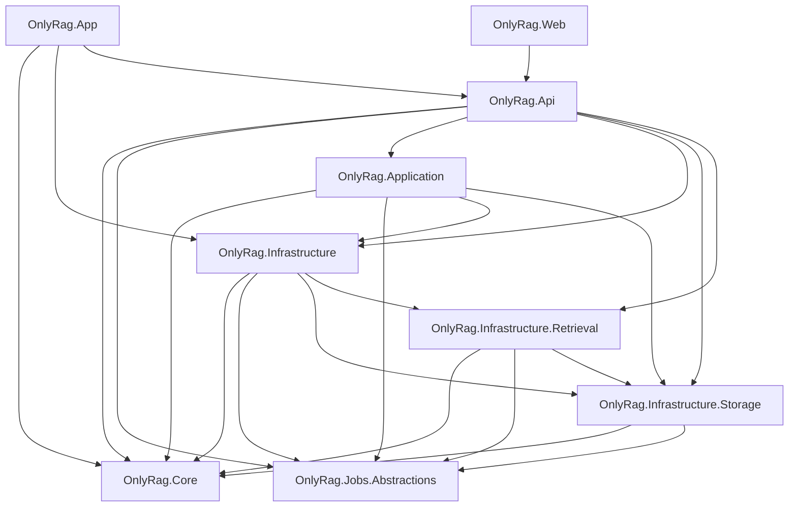
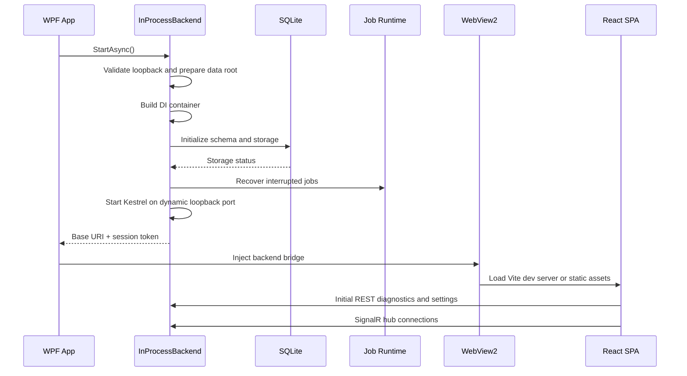

# Revisione Architetturale di OnlyRag

**Data analisi:** 2026-08-12  
**Ambito:** struttura del repository, dipendenze, runtime, flussi applicativi, persistenza, retrieval, agenti, frontend e debito tecnico.

## 1. Executive Summary

OnlyRag è un'applicazione desktop Windows **local-first** costruita come **modular monolith**. Un unico processo WPF ospita la shell desktop, avvia un backend ASP.NET Core Minimal API in-process e carica una SPA React tramite WebView2. Il backend coordina storage SQLite SQLCipher, job persistiti, retrieval ibrido, Qdrant, OCR, Ollama, agenti autonomi, generazione immagini e servizi opzionali locali o cloud.

Il progetto non è una piattaforma a microservizi e non è una Clean Architecture pura. Presenta una buona separazione per assembly e feature, ma alcuni confini sono ancora permeabili: il layer `Application` dipende direttamente da `Infrastructure`, mentre `OnlyRag.Api` concentra una quantità elevata di orchestration e runtime management.

La valutazione complessiva è positiva sul piano della completezza funzionale e dei guardrail operativi, ma i rischi principali riguardano:

- accoppiamento tra Application e Infrastructure;
- concentrazione di responsabilità in `OnlyRag.Api` e `AgentLoopEngine`;
- contratti REST duplicati tra Core, API e TypeScript;
- dipendenza da numerosi runtime locali e relativi cold start;
- persistenza ibrida EF Core/SQL manuale/schema initializer;
- ricostruzione incompleta dello stato UI dopo reconnect o riavvio;
- uniformità non completa della gestione degli errori e dell'osservabilità.

## 2. Classificazione Architetturale

### Pattern prevalente

```text
Desktop Modular Monolith
├── WPF Desktop Shell
├── In-process ASP.NET Core Backend
├── React/Vite SPA in WebView2
├── Local Persistent Job Runtime
├── SQLite SQLCipher System of Record
└── Qdrant Local/Remote Vector Index
```

### Pattern complementari

- **Layered architecture:** `Core`, `Application`, `API`, `Infrastructure`.
- **Dependency Injection:** composizione centralizzata in `InProcessBackend.ServiceRegistration`.
- **Ports and adapters parziale:** interfacce in Core e implementazioni in Infrastructure.
- **Producer-consumer:** pipeline ingestion e worker job basati su asincronia e canali.
- **Repository pattern:** repository specifici per documenti, embedding, chat, traduzioni, settings e job.
- **CQRS leggero:** separazione pratica tra operazioni di lettura e scrittura, senza bus CQRS formale.
- **Sidecar process pattern:** Qdrant eseguito come processo locale supervisionato dall'applicazione.
- **Progressive degradation:** fallback FTS5, re-ranking euristico, OCR alternativo e polling REST.

### Perché non è Clean Architecture pura

Il progetto `OnlyRag.Application` referenzia direttamente `OnlyRag.Infrastructure` e `OnlyRag.Infrastructure.Storage`, come definito in [OnlyRag.Application.csproj](../src/OnlyRag.Application/OnlyRag.Application.csproj). Questo significa che l'application layer può conoscere implementazioni tecnologiche concrete, anziché dipendere esclusivamente da contratti astratti in `OnlyRag.Core`.

Il test [ArchitectureGuardrailTests.cs](../tests/OnlyRag.Application.Tests/ArchitectureGuardrailTests.cs) controlla una parte dei confini tra progetti, ma non rappresenta in modo completo tutti i moduli presenti nella solution, in particolare `Infrastructure.Storage`, `Infrastructure.Retrieval` e gli eventuali progetti worker.

## 3. Struttura del Repository

### `src/OnlyRag.App`

Shell WPF e entry point desktop. Responsabilità:

- bootstrap del processo;
- verifica prerequisiti Windows e WebView2;
- creazione della `MainWindow`;
- avvio e arresto del backend in-process;
- gestione del ciclo di vita WebView2;
- iniezione di `window.__ONLYRAG_BACKEND__`;
- caricamento degli asset statici o del dev server Vite;
- conferma di chiusura e preparazione all'uscita.

Riferimenti principali:

- [App.xaml.cs](../src/OnlyRag.App/App.xaml.cs)
- [MainWindow.xaml.cs](../src/OnlyRag.App/MainWindow.xaml.cs)
- [MainWindow.Startup.cs](../src/OnlyRag.App/MainWindow.Startup.cs)
- [MainWindow.Exit.cs](../src/OnlyRag.App/MainWindow.Exit.cs)

### `src/OnlyRag.Web`

SPA React 19 + TypeScript + Vite ospitata dentro WebView2. Responsabilità:

- shell UI e navigazione tra sezioni;
- Chat;
- Coding e agenti;
- document library;
- immagini;
- traduzioni;
- knowledge graph;
- settings e diagnostica;
- polling e cache tramite React Query;
- eventi realtime tramite SignalR;
- fallback REST per gli stream e i job;
- lifecycle applicativo e stato di uscita.

Riferimenti principali:

- [App.tsx](../src/OnlyRag.Web/src/App.tsx)
- [main.tsx](../src/OnlyRag.Web/src/main.tsx)
- [apiClient.ts](../src/OnlyRag.Web/src/apiClient.ts)
- [signalrService.ts](../src/OnlyRag.Web/src/services/signalrService.ts)
- [SignalRContext.tsx](../src/OnlyRag.Web/src/context/SignalRContext.tsx)
- [appLifecycle.ts](../src/OnlyRag.Web/src/appLifecycle.ts)

### `src/OnlyRag.Core`

Boundary contrattuale condiviso. Contiene:

- DTO request/response;
- record immutabili;
- interfacce per servizi e repository;
- contratti per chat, retrieval, agenti, jobs, OCR, immagini, settings e provider;
- modelli di configurazione;
- tipi di errore e risposte standard.

Il progetto non ha riferimenti a UI, API o Infrastructure e rappresenta il confine più stabile dell'architettura.

### `src/OnlyRag.Api`

Backend ASP.NET Core Minimal API in-process. È il principale composition root e coordina:

- Kestrel su loopback e porta dinamica;
- DI e hosted services;
- middleware di errore;
- autenticazione tramite token di sessione;
- mapping delle route;
- SignalR;
- orchestrazione chat e agenti;
- job worker;
- lifecycle di Qdrant;
- diagnostica;
- provider Ollama/cloud;
- workspace tools;
- update e export.

Riferimenti principali:

- [InProcessBackend.cs](../src/OnlyRag.Api/InProcessBackend.cs)
- [InProcessBackend.Application.cs](../src/OnlyRag.Api/InProcessBackend.Application.cs)
- [InProcessBackend.ServiceRegistration.cs](../src/OnlyRag.Api/InProcessBackend.ServiceRegistration.cs)
- [InProcessBackend.EndpointMapping.cs](../src/OnlyRag.Api/InProcessBackend.EndpointMapping.cs)
- [InProcessBackend.Auth.cs](../src/OnlyRag.Api/InProcessBackend.Auth.cs)

### `src/OnlyRag.Application`

Layer applicativo e use case. Il layer è utile come boundary concettuale, ma la sua indipendenza è incompleta perché dipende direttamente da implementazioni di Infrastructure.

### `src/OnlyRag.Infrastructure`

Adapter tecnologici e servizi tecnici:

- Ollama e cloud LLM;
- OCR PaddleOCR e ONNX DirectML;
- image generation ONNX/Stable Diffusion;
- export LibreOffice;
- agent tools e workspace;
- logging;
- ingestion;
- sincronizzazione Qdrant;
- integrazione con servizi Windows;
- runtime di processi locali.

### `src/OnlyRag.Infrastructure.Storage`

Persistenza locale e schema:

- SQLite SQLCipher;
- EF Core `OnlyRagDbContext`;
- `LocalSqliteSchemaInitializer`;
- SQL parametrizzato tramite `ISqliteConnectionFactory`;
- repository documenti, chunks, embedding, chat, traduzioni, immagini, settings e agent runs;
- coda job persistita;
- cache OCR e audit policy.

### `src/OnlyRag.Infrastructure.Retrieval`

Motore RAG e ricerca:

- SQLite FTS5;
- embedding query;
- Qdrant;
- Reciprocal Rank Fusion;
- query transformation;
- cross-encoder ONNX;
- fallback euristico;
- parent-child resolution;
- CRAG;
- knowledge graph retrieval.

### `src/OnlyRag.Jobs.Abstractions`

Contratti della coda locale:

- job record;
- status e lifecycle;
- interfacce queue e handler;
- progress e cancellation contracts.

L'implementazione del runtime è in API, mentre la persistenza dei job è in Storage.

### `tests`

Contiene:

- test xUnit Core;
- test API;
- test Application;
- test Infrastructure;
- host backend per Playwright;
- test architetturali;
- test di integrazione selezionati.

### `docs`

Documentazione architetturale e operativa:

- architettura;
- application flow;
- pipeline RAG;
- agent engine;
- OCR;
- image generation;
- traduzione;
- operations;
- packaging e signing.

### `scripts`

Automazione PowerShell:

- bootstrap prerequisiti;
- restore e build web;
- build desktop;
- test e gate;
- packaging NSIS;
- firma digitale;
- manifest e integrità runtime;
- OCR;
- retrieval evaluation;
- pulizia output.

### `packaging` e `assets`

`packaging` contiene installer NSIS e payload/manifest di runtime. `assets` contiene asset brand generati e materiale di distribuzione. Gli output generati non devono essere modificati manualmente senza rigenerare la fonte.

## 4. Grafo delle Dipendenze



La direzione più problematica è:

```text
Application -> Infrastructure
```

che riduce l'isolamento del layer applicativo.

## 5. Entry Point e Bootstrap Runtime

### Sequenza di avvio



L'implementazione è in [InProcessBackend.cs](../src/OnlyRag.Api/InProcessBackend.cs). Il backend viene inizializzato prima dell'uso normale della UI, ma la UI WPF viene mostrata prima che il bootstrap asincrono sia completato; questo consente di visualizzare stati di caricamento o offline.

## 6. Comunicazione tra Frontend e Backend

### REST

Il frontend usa `apiRequest` per:

- stato applicazione;
- diagnostica;
- documenti;
- jobs;
- settings;
- workspace;
- graph;
- immagini;
- traduzioni;
- export;
- update;
- dipendenze locali.

Il client HTTP:

- risolve l'URL dal bridge WPF;
- aggiunge il token di sessione;
- applica retry selettivi;
- converte `ProblemDetails` in errori UI;
- marca il backend offline in caso di failure di rete.

### SignalR

Sono presenti due hub:

- `ChatStreamHub` per stream di token e completamento chat;
- `JobProgressHub` per progress, completamento e failure dei job.

Il frontend abilita automatic reconnect e usa il polling REST come fallback operativo.

### Token di sessione

Il backend:

1. accetta solo connessioni loopback;
2. genera un token casuale di 32 byte se non viene fornito dalle options;
3. richiede il token su tutte le route `/api`;
4. usa confronto constant-time;
5. trasferisce token e URL alla WebView tramite script iniettato.

Questo modello è coerente con una app single-user locale, ma il token è accessibile al contesto JavaScript della WebView2. La sicurezza dipende quindi dall'integrità e dall'isolamento degli asset caricati.

## 7. Flussi Operativi Principali

### 7.1 Importazione documenti

```mermaid
flowchart LR
    Upload[Upload da React] --> API[Document endpoint]
    API --> Validate[Limiti, quota, path, hash, formato]
    Validate --> Record[Record documento in SQLite]
    Record --> Enqueue[Enqueue document-ingestion]
    Enqueue --> Worker[LocalJobWorkerService]
    Worker --> Parse[Parser TXT/MD/CSV/PDF/OpenXML/archive/image]
    Parse --> OCR[OCR se necessario]
    OCR --> Chunk[Parent/Child chunking]
    Chunk --> FTS[SQLite FTS5 + metadata]
    Chunk --> EmbedJob[document-embedding job]
    EmbedJob --> LLM[Ollama o provider cloud]
    LLM --> Qdrant[Qdrant vector index]
```



Sono supportati testi, Markdown, CSV, PDF, OpenXML, immagini e archivi con controlli su:

- path traversal;
- dimensioni dichiarate ed effettive;
- archive bomb;
- numero di file;
- quota storage;
- duplicati;
- provenance degli elementi dell'archivio.

### 7.2 Ricerca ibrida e RAG

Il servizio centrale è [HybridRetrievalService.cs](../src/OnlyRag.Infrastructure.Retrieval/Retrieval/HybridRetrievalService.cs).

Pipeline:

1. normalizzazione della query;
2. query transformation: multi-query, sub-query o HyDE;
3. ricerca keyword via SQLite FTS5;
4. generazione embedding della query;
5. ricerca vettoriale su Qdrant;
6. fusione RRF dei candidati;
7. re-ranking cross-encoder ONNX;
8. fallback a re-ranking euristico se necessario;
9. risoluzione dei child chunk nel parent context;
10. valutazione CRAG;
11. eventuale riformulazione;
12. restituzione di fonti, pagine, chunk e metriche di latenza.

FTS5 e generazione embedding vengono avviati in parallelo. La ricerca Qdrant dipende dall'embedding disponibile. Il risultato conserva la provenienza necessaria alle citazioni.

### 7.3 Chat

[ChatService.cs](../src/OnlyRag.Api/ChatService.cs) esegue:

1. validazione messaggio e conversation ID;
2. verifica che il modello sia installato;
3. caricamento degli ultimi messaggi;
4. retrieval se la chat documentale è attiva;
5. costruzione del prompt con contesto e fonti;
6. generazione Ollama;
7. verifica `GroundingVerifier` per risposte documentali;
8. emissione di notice su assenza o conflitto di evidenza;
9. persistenza del turno;
10. restituzione di risposta e citazioni.

La modalità stream invia token tramite SignalR e/o SSE, quindi esegue la verifica grounding dopo la conclusione della generazione.

### 7.4 Job locali

[LocalJobWorkerService.cs](../src/OnlyRag.Api/LocalJobWorkerService.cs) gestisce:

- lease atomico dei job;
- parallelismo configurabile;
- throttling hardware;
- pause e resume;
- cancellazione;
- retry;
- checkpoint;
- recovery dopo chiusura o crash;
- progress SignalR;
- errori persistiti.

I principali handler coprono ingestion, embedding, traduzione e pull dei modelli Ollama.

### 7.5 Agenti autonomi

[AgentLoopEngine.cs](../src/OnlyRag.Api/AgentLoopEngine.cs) coordina un ciclo persistito e verificabile:

```text
PLAN -> ACT -> OBSERVE -> VERIFY -> RECOVER -> FINALIZE -> COMPLETED
```

L'engine integra:

- prompt e contesto workspace;
- chiamate Ollama;
- parsing tool call;
- tool execution;
- approval flow;
- policy enforcement;
- audit;
- memoria episodica;
- checkpoint;
- subagent;
- AST dependency graph;
- verifica dei risultati;
- resume di run interrotti.

`WorkspaceToolExecutor` applica il controllo workspace prima di permettere operazioni filesystem o comandi locali.

### 7.6 Traduzione

Il frontend crea una traduzione associata a un documento indicizzato. Il backend:

1. valida documento e modello;
2. crea unità per pagina;
3. enqueue del job;
4. chiama Ollama per unità;
5. salva checkpoint e progress;
6. espone revisione manuale;
7. esporta TXT, Markdown, HTML, DOCX o PDF.

### 7.7 Shutdown

Alla chiusura:

1. il frontend raccoglie contributor con modifiche o lavoro attivo;
2. richiede conferma se necessario;
3. prepara lo stato delle sezioni;
4. il backend cancella o checkpointa i job in esecuzione;
5. Qdrant e processi figli vengono arrestati;
6. il backend viene disposed;
7. WebView2 viene chiuso.

Il meccanismo è funzionale, ma il percorso WPF contiene una attesa sincrona temporizzata (`Wait`) durante `OnExit`, con soppressione delle eccezioni.

## 8. Modello dei Dati e Persistenza

### SQLite

SQLite SQLCipher è il system of record locale per:

- documents;
- pages;
- chunks parent/child;
- FTS5 metadata;
- vector index status;
- jobs;
- chat conversations/messages;
- translations/translation units;
- OCR cache;
- generated images;
- settings;
- agent runs e transitions;
- agent trace events;
- policy audit;
- graph nodes e edges;
- archive manifest.

La chiave viene recuperata tramite integrazione Windows Credential Manager/DPAPI.

### Qdrant

Qdrant conserva l'indice vettoriale e i payload dei chunk. SQLite conserva lo stato di sincronizzazione, il modello, la dimensione e l'identificativo del punto Qdrant.

Questo crea una relazione a due sistemi:

```text
SQLite metadata/status <-> Qdrant vectors
```

La presenza di un servizio di sync/repair è importante, perché un'incoerenza tra i due sistemi può produrre documenti apparentemente indicizzati ma non ricercabili.

### Persistenza ibrida EF Core/SQL

Il repository usa:

- `OnlyRagDbContext` e EF Core per modello/schema;
- SQL diretto tramite `ISqliteConnectionFactory` per gran parte dei repository;
- `LocalSqliteSchemaInitializer` come fonte operativa dello schema e delle versioni.

Questa combinazione è efficiente e controllabile, ma richiede disciplina per mantenere allineati modello EF, SQL manuale e migrazioni non distruttive.

## 9. Criticità e Debito Tecnico

### P0 - Application dipende da Infrastructure

**Evidenza:** [OnlyRag.Application.csproj](../src/OnlyRag.Application/OnlyRag.Application.csproj) referenzia `OnlyRag.Infrastructure` e `OnlyRag.Infrastructure.Storage`.

**Impatto:**

- test applicativi meno isolabili;
- sostituzione degli adapter più difficile;
- rischio di accoppiamento crescente;
- boundary teorici diversi da quelli effettivi.

**Raccomandazione:** spostare i contratti necessari in `OnlyRag.Core` o in un assembly contracts dedicato e lasciare il wiring concreto al composition root API.

### P0 - Concentrazione di responsabilità in `OnlyRag.Api`

API contiene bootstrap, endpoint, chat, agenti, worker, Qdrant lifecycle, diagnostica, provider e process supervision.

**Impatto:**

- modifiche trasversali ad alto rischio;
- test più complessi;
- ownership poco chiara;
- maggiore probabilità di regressioni tra feature.

**Raccomandazione:** mantenere API sottile e spostare gli use case in application services dedicati.

### P0 - `AgentLoopEngine` troppo grande

L'engine concentra prompting, loop, tool orchestration, policy, approval, recovery, persistenza, memoria e subagent.

**Raccomandazione di scomposizione:**

- `AgentPromptContextBuilder`;
- `AgentTurnRunner`;
- `AgentToolOrchestrator`;
- `AgentApprovalService`;
- `AgentRunPersistence`;
- `AgentRecoveryService`;
- `AgentVerificationService`.

### P1 - Drift dei contratti API

Il frontend usa tipi manuali in `api.ts`, `apiClient.ts` e `apiTypes`, mentre OpenAPI è opzionale e i tipi generati non sono la fonte primaria utilizzata dall'applicazione.

**Impatto:** possibile divergenza tra Core, endpoint e TypeScript.

**Raccomandazione:** rendere OpenAPI riproducibile e vincolante per REST, con check CI tra schema e tipi generati. Mantenere manuali solo SignalR/SSE quando motivato.

### P1 - Single-process e scalabilità verticale

WPF, API, worker e runtime di coordinamento condividono un processo.

**Vantaggi:** semplicità, latenza bassa, deployment local-first.

**Limiti:**

- crash del processo desktop impatta tutti i servizi;
- OCR, immagini, embedding e retrieval competono per risorse;
- nessuna scalabilità orizzontale;
- shutdown e recovery sono più delicati;
- un singolo processo può diventare un collo di bottiglia per workload intensivi.

### P1 - Cold start e provisioning runtime

Qdrant, OCR, modelli LLM e ONNX possono richiedere provisioning, download, caricamento e health check.

Sono già documentati casi di cold start Qdrant molto lunghi.

**Raccomandazione:** tracciare separatamente:

1. verifica manifest;
2. download;
3. estrazione;
4. scansione/integrità;
5. avvio processo;
6. readiness probe;
7. disponibilità effettiva per le query.

### P1 - Gestione errori non uniforme

Il middleware globale produce `ProblemDetails` e correlation ID, ma numerosi endpoint catturano genericamente `Exception` e restituiscono direttamente `ex.Message`.

**Rischi:**

- dettagli infrastrutturali esposti alla UI;
- messaggi non localizzati;
- codici errore incoerenti;
- difficoltà di correlazione tra errore utente e log tecnico.

**Raccomandazione:** usare eccezioni applicative tipizzate e un mapper centralizzato per status code, error code e messaggi pubblici.

### P1 - Gestione shutdown con attesa sincrona

In [App.xaml.cs](../src/OnlyRag.App/App.xaml.cs) `OnExit` attende sincronicamente il dispose del backend per un massimo di cinque secondi e sopprime l'eccezione.

**Rischi:**

- shutdown incompleto;
- errori non osservabili;
- stato di job/processi non chiaramente comunicato;
- potenziale blocco del thread UI.

**Raccomandazione:** progettare una fase di shutdown asincrona esplicita e osservabile, con timeout per componente e stato finale persistito.

### P1 - Persistenza ibrida e schema manuale

EF Core, SQL diretto e schema initializer manuale condividono lo stesso database.

**Rischi:**

- drift tra modello e schema;
- migrazioni difficili da verificare;
- regressioni su versioni precedenti;
- maggiore costo di onboarding.

**Raccomandazione:** formalizzare ownership dello schema, version target, migration path e test di compatibilità per ogni release.

### P2 - Stato UI non completamente ricostruibile

I job backend sono persistiti, ma lo stato di Chat, Coding, Traduzione e Immagini non è uniformemente ricostruibile dopo:

- reconnect SignalR;
- ricreazione WebView2;
- riavvio controllato;
- chiusura durante stream.

**Raccomandazione:** associare ogni operazione UI a un job/run ID persistente e usare REST come fonte autorevole per il resume.

### P2 - Controller frontend sovraccarichi

Alcuni controller frontend combinano query, mutation, polling, retry, stato locale, error handling e lifecycle.

**Raccomandazione:** separare controller per use case: query state, job lifecycle, settings actions, dependency actions, model catalog, generation e persistence.

### P2 - Osservabilità incompleta

Sono presenti log locali, tracing e diagnostica, ma non tutti i risultati espongono:

- timestamp dell'ultimo probe;
- età della cache;
- dettaglio operativo azionabile;
- fase corrente di provisioning;
- retry contestuale;
- metrica coerente tra frontend e backend.

**Raccomandazione:** estendere i contratti diagnostici con freschezza, correlation ID, fase operativa, durata e azione suggerita.

### P2 - Dipendenze locali numerose

Il prodotto dipende, con diversi livelli di opzionalità, da:

- Windows;
- WebView2;
- .NET 10;
- Node/npm per sviluppo;
- Ollama;
- Qdrant;
- Python/PaddleOCR;
- LibreOffice;
- runtime DirectML;
- NSIS e signtool per release.

Questo non è necessariamente un difetto per un'app desktop local-first, ma aumenta la superficie di supporto, diagnosi e packaging.

## 10. Punti di Forza

- Architettura modulare e comprensibile.
- Contratti condivisi in `OnlyRag.Core`.
- Separazione feature-based degli endpoint.
- Pipeline ingestion asincrona e checkpointed.
- Job persistiti con recovery dopo interruzione.
- Fallback FTS5 e re-ranking euristico.
- Verifica grounding con citazioni.
- Protezione loopback e token di sessione.
- Storage locale cifrato e gestione credenziali tramite vault Windows.
- Validazione degli archivi contro path traversal e archive bomb.
- Test di architettura e gate di qualità automatizzati.
- Packaging, manifest e signing trattati come parte del sistema.

## 11. Roadmap Architetturale Raccomandata

### Fase 1 - Stabilizzazione dei boundary

1. Rimuovere le dipendenze concrete di `Application` da `Infrastructure`.
2. Estendere il test architetturale a tutti i progetti della solution.
3. Formalizzare ownership dei contratti REST e SignalR.
4. Centralizzare error mapping e correlation handling.

### Fase 2 - Riduzione della concentrazione

1. Scomporre `AgentLoopEngine`.
2. Ridurre il composition root API a bootstrap e mapping.
3. Estrarre Qdrant lifecycle, diagnostics e agent orchestration in servizi applicativi separati.
4. Separare i controller frontend per use case.

### Fase 3 - Resilienza runtime

1. Rendere osservabile il cold start di Qdrant/OCR/modelli.
2. Uniformare resume dopo reconnect WebView2/SignalR.
3. Rendere completamente esplicito il protocollo di shutdown.
4. Aggiungere test per crash/restart durante ingestion, embedding e traduzione.

### Fase 4 - Evoluzione dei contratti e dello storage

1. Rendere OpenAPI generato riproducibile.
2. Aggiungere controllo automatico di drift tra Core, OpenAPI e TypeScript.
3. Documentare e testare la strategia EF Core + SQL manuale.
4. Aggiungere verifiche di consistenza SQLite/Qdrant e procedure di repair osservabili.

## 12. Conclusione

OnlyRag è un modular monolith desktop ben strutturato, con un impianto tecnico coerente con un prodotto Windows local-first e con workload AI intensivi. La base è sufficientemente solida per evolvere, ma l'architettura è entrata nella fase in cui la crescita delle feature rischia di concentrare troppa logica nei coordinatori principali.

La priorità non è introdurre nuovi framework o trasformare il progetto in microservizi. La strategia più pragmatica è:

1. rafforzare i boundary già esistenti;
2. ridurre l'accoppiamento Application/Infrastructure;
3. scomporre i coordinatori ad alta complessità;
4. rendere i contratti e lo stato persistente realmente single-source;
5. migliorare osservabilità, shutdown e recovery.

Questi interventi migliorerebbero testabilità, manutenibilità e affidabilità senza compromettere il modello local-first né introdurre una complessità architetturale sproporzionata.
