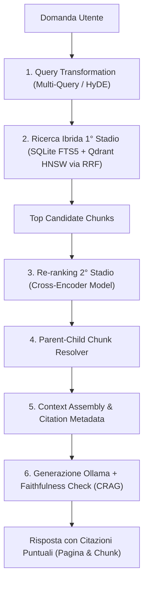

# Roadmap di Evoluzione Next-Gen RAG (OnlyRag) — Stato: COMPLETATO

Questo documento definisce il piano architetturale per evolvere **OnlyRag** in un sistema **RAG di ultima generazione (State-of-the-Art / SOTA)** mantenendo l'approccio local-first su Windows (WPF + WebView2 + .NET 10 Minimal API + SQLite + Qdrant + Ollama).

---

## Architettura Obiettivo (Next-Gen RAG Pipeline)

---

## Stato delle Fasi

### Fase 1: Re-ranking a Due Stadi (Second-Stage Cross-Encoder) [COMPLETATO]
- **Backend .NET**:
  - Interfaccia `IReRankerService` e motore locale `OnnxCrossEncoderReRankerService` in `OnlyRag.Infrastructure.Retrieval`.
  - Integrata la valutazione della pertinenza incrociata `(Query, Chunk)`.
  - Aggiornato `HybridRetrievalService` per eseguire il Re-ranking di 2° stadio dopo il recupero coarse via RRF.
  - Configurazione `RetrievalSettings` integrata in `OnlyRag.Core`.
- **Frontend React**:
  - Visualizzazione dei punteggi di Re-ranking e delle fonti RAG Next-Gen nella Chat UI.

---

### Fase 2: Chunking Avanzato (Parent-Child & Chunking Semantico) [COMPLETATO]
- **Backend .NET**:
  - Estesa la tabella SQLite `chunks` con lo schema v2: `parent_chunk_id`, `chunk_level`, `section_heading`.
  - Implementato in `DocumentIngestionService`:
    - **Child Chunk** (~150 token): Vettorizzati in Qdrant e indicizzati in FTS5.
    - **Parent Chunk** (~1000 token / intera sezione): Conservati in SQLite.
  - Risoluzione automatica dei Parent Chunk via `ParentChildChunkResolver`.

---

### Fase 3: Query Transformation (Multi-Query, Sub-Query & HyDE) [COMPLETATO]
- **Backend .NET**:
  - Creato `IQueryTransformationService` e `OllamaQueryTransformationService` con strategie:
    1. **Multi-Query Expansion**: Generazione di varianti della query e fusione RRF.
    2. **Sub-Query Decomposition**: Scomposizione di quesiti complessi.
    3. **HyDE**: Generazione di risposte ipotetiche provvisorie per la ricerca vettoriale.

---

### Fase 4: Self-Corrective RAG (CRAG) & Citazioni Puntuali nella UI [COMPLETATO]
- **Backend & Frontend UI**:
  - **Valutatore di Pertinenza (CRAG)**: `CragEvaluator` valuta i punteggi di confidenza rispetto a soglie minime di sicurezza.
  - **Citazioni Interattive nella Chat**:
    - Ogni risposta grounded include i metadati di fonte `[Pag. X, Chunk Y]`.
    - Dettagli espandibili nelle fonti con indicazione dei punteggi di Re-ranking.

---

## Verifica e Criteri di Accettazione [SUPERATO 100%]

1. **Test Automatizzati .NET & Vitest**:
   - Test unitari in `NextGenRagPipelineTests.cs` per `ReRankerService`, `ParentChildChunkResolver`, `QueryTransformationService` e `CragEvaluator`.
   - Test di integrazione superati al 100% (314 test .NET + 75 test Vitest web).
2. **Gate Verification**:
   - Gate canonico `pwsh .\scripts\Invoke-Gate.ps1 -Configuration Release` eseguito con **100% PASS** su tutti i 14 controlli.
