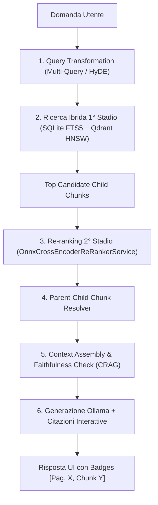

# Pipeline RAG

OnlyRag utilizza una pipeline RAG a 6 stadi basata su acquisizione documenti locale, ricerca ibrida (SQLite FTS5 + Qdrant HNSW), re-ranking ONNX Cross-Encoder con fallback euristico, risoluzione Parent-Child, Knowledge Graph Traversal e valutazione di confidenza Self-Corrective RAG (CRAG).

---

## Flusso dell'Architettura



---

## 1. Indicizzazione & Dual-Tier Chunking (Parent-Child)

I formati supportati per l'importazione diretta sono `.txt`, `.md`, `.csv`, `.pdf`, `.docx`, `.xlsx`, `.pptx` e immagini (`.png`, `.jpg`, `.jpeg`, `.bmp`, `.webp`, `.tiff`).
- **Office OpenXML (DOCX, XLSX, PPTX)**: Estrazione nativa del testo via `DocumentFormat.OpenXml` senza dipendenze esterne.
- **Formati Binari Legacy Non Supportati**: I file binari Office obsoleti (`.doc`, `.xls`, `.ppt`) vengono rifiutati all'upload; occorre risalvarli nel formato OpenXML prima dell'importazione.

Il sistema di chunking genera una gerarchia **Parent-Child**:
- **Child Chunks (~150 token)**: Indicizzati in SQLite FTS5 e vettorizzati su Qdrant per il matching ad alta risoluzione.
- **Parent Chunks (~1000 token / paragrafo completo)**: Conservati nel database SQLite per preservare il contesto informativo ampio.

La pipeline di ingestion supporta l'elaborazione ad alte prestazioni in streaming tramite l'architettura Producer-Consumer basata su `System.Threading.Channels` (`StreamingDocumentIngestionPipeline`), eliminando i picchi di memoria RAM e parallelizzando le fasi di **Parsing -> Chunking -> Embedding -> VectorStoreWriter**.

I dati sono gestiti dai servizi sotto [`src/OnlyRag.Infrastructure/Ingestion`](../src/OnlyRag.Infrastructure/Ingestion) e conservati nello schema SQLite corrente (gestito tramite EF Core 10 `OnlyRagDbContext` / `LocalSqliteSchemaInitializer`) sotto [`src/OnlyRag.Infrastructure/Storage`](../src/OnlyRag.Infrastructure/Storage). Lo schema include anche le tabelle `document_graph_nodes` e `document_graph_edges` per l'indicizzazione delle relazioni di grafo tra concetti e sezioni documentali.

### Sicurezza Archivi

La configurazione di ingestione include limiti persistenti per il numero di file, la dimensione decompressa totale e per singolo file, e la profondità delle directory. Il servizio `ArchiveExtractionService` legge ZIP, TAR e 7Z senza estrarre in una directory controllata dall'archivio: convalida ogni percorso (nessun path assoluto o traversal) e consegna il contenuto in streaming al chiamante. I limiti vengono verificati sui byte effettivamente letti, proteggendo anche da archive bomb con metadati falsificati. L'importazione accetta gli archivi come documenti contenitore; gli elementi TXT/MD/CSV, Office Open XML e PDF vengono indicizzati come pagine dello stesso documento, con il percorso dell'elemento conservato nella provenienza testuale. Le immagini (.png, .jpg, .jpeg, .bmp, .gif, .tif, .tiff, .webp) vengono processate via OCR nell'archivio. Il manifest SQLite `archive_manifest_entries` è collegato al documento contenitore. Il manifest è consultabile tramite `GET /api/documents/{id}/archive-manifest`.

---

## 2. Knowledge Graph & Graph Retrieval

OnlyRag include un motore di indicizzazione e recupero a grafo (Knowledge Graph Retrieval) integrato:
- **Tabelle SQLite Graph**: `document_graph_nodes` e `document_graph_edges` gestiscono entità, relazioni semanticamente estratte, nodi concettuali e collegamenti tra documenti e sezioni.
- **Service Layer**: [`SqliteGraphRetrievalService`](../src/OnlyRag.Infrastructure/Retrieval/Graph/SqliteGraphRetrievalService.cs) implementa [`IGraphRetrievalService`](../src/OnlyRag.Infrastructure/Retrieval/Graph/IGraphRetrievalService.cs) per eseguire traversal k-hop sui nodi, estrazione di sotto-grafi e ricerca di percorsi relazionali tra concetti.
- **Endpoints Graph**:
  - `GET /api/graph/data`: Restituisce i nodi e gli archi del grafo con filtri opzionali (`limit`, `documentId`, `entityType`).
  - `POST /api/graph/search`: Esegue ricerche con traversal multi-hop (`query`, `maxHops`, `maxNodes`).
- **Visualizzazione UI**: Sezione React [`KnowledgeGraphSection`](../src/OnlyRag.Web/src/components/graph/KnowledgeGraphSection.tsx) con canvas [`KnowledgeGraphCanvas`](../src/OnlyRag.Web/src/components/graph/KnowledgeGraphCanvas.tsx) per la navigazione interattiva della rete di concetti.

---

## 3. Vettorizzazione & Storage Vettoriale

I task di embedding comunicano con l'endpoint Ollama configurato. I vettori vengono salvati su Qdrant locale gestito tramite [`packaging/qdrant/manifest.json`](../packaging/qdrant/manifest.json) e avviato dal servizio in-process [`QdrantLocalRuntimeService`](../src/OnlyRag.Infrastructure/Vector/QdrantSettingsStore.cs).

Le collezioni sono separate per modello di embedding e dimensione del vettore. SQLite gestisce i metadati dei documenti e delle risorse; Qdrant gestisce gli indici vettoriali.

---

## 4. Recupero a Due Stadi & Query Transformation

Il recupero è orchestrato da [`HybridRetrievalService`](../src/OnlyRag.Infrastructure/Retrieval/HybridRetrievalService.cs) ed è strutturato in 6 stadi:

1. **Query Transformation**: Espansione di varianti sintattiche/semantiche della query tramite [`IQueryTransformationService`](../src/OnlyRag.Infrastructure/Retrieval/IQueryTransformationService.cs) (Multi-Query, Sub-Query, HyDE).
2. **Ricerca Ibrida di 1° Stadio**: Combinazione dei candidati FTS5 e Qdrant tramite l'algoritmo **Reciprocal Rank Fusion (RRF)**.
3. **Re-ranking di 2° Stadio**: Calcolo del punteggio di pertinenza incrociata `(Query, Chunk)` tramite il re-ranker [`IReRankerService`](../src/OnlyRag.Infrastructure/Retrieval/IReRankerService.cs) (`OnnxCrossEncoderReRankerService` come primario, con `HeuristicReRankerService` come fallback).
4. **Parent-Child Resolver**: Risoluzione dei Child Chunk selezionati nei corrispondenti Parent Chunk tramite [`ParentChildChunkResolver`](../src/OnlyRag.Infrastructure/Retrieval/ParentChildChunkResolver.cs).
5. **Valutazione CRAG (Self-Corrective RAG)**: Valutazione della confidenza dei risultati tramite [`CragEvaluator`](../src/OnlyRag.Infrastructure/Retrieval/CragEvaluator.cs) e assemblaggio del contesto.
6. **Generazione LLM & Citazioni Interattive**: Invio del contesto arricchito a Ollama e generazione di risposte grounded corredate da citazioni interattive `[Pag. X, Chunk Y]`.

---

## 5. Valutazione della Qualità di Recupero

È possibile valutare la qualità di recupero (Recall@K, MRR, dimensione contesto) tramite lo script di benchmark dedicato:

```powershell
pwsh .\scripts\Evaluate-Retrieval.ps1 -DatasetPath .\docs\retrieval-evaluation.sample.json
```

## Grounding Obbligatorio

Quando la chat usa documenti, gli estratti recuperati vengono prima sintetizzati nel prompt e la risposta finale passa sempre da una verifica runtime via `GroundingVerifier`. Ogni paragrafo fattuale deve includere una citazione `Source: NomeDocumento` valida e condividere termini significativi con lo snippet citato. Le risposte non supportate vengono sostituite da un’astensione esplicita; le evidenze con negazioni opposte e termini condivisi producono il notice `grounding_conflicting_evidence`.
